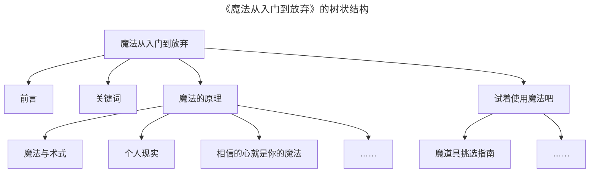
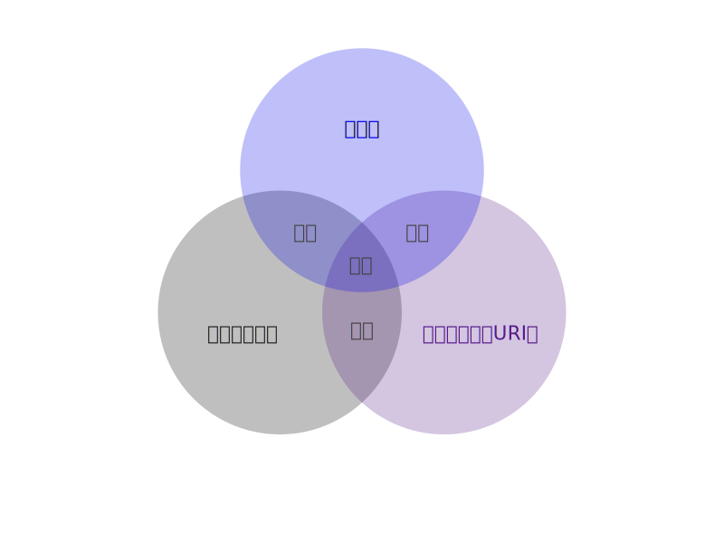

# 通用写作律法

```yaml
标题: 通用写作律法
创建时间: 2023-08-26
版本: 0.0.38-beta
```

《<ruby>通用写作律法<rp>(</rp><rt>General Writing Laws</rt><rp>)</rp></ruby>》是由
[Save The Web Project][] 设计的开放律法（标准），后文简称为《律法》。

《律法》有多种设想的使用场景，分别是：

1.  阅读：寻找适合自己的写作规则。
2.  使用：完善自己的写作规则，不再模棱两可。
3.  共享：将精心选配的《律法》规则作为团队的写作规范。

《律法》出现的根本原因，是在不使用专业排版工具的情况时，以及无 CSS 自动优化的时候，
比如在 Twitter、Facebook 以及 Telegram 等地，纯粹的使用文本、符号和空格来让文字排版得美观易读。

并且每个人都有自己的习惯以及美学，要求他人使用某种固定的规范是不太现实的，
所以不如每个人遵守自己精心选配的《律法》，如果团队写作有需求使用相同的规范，
那么使用《律法》模块化的搭建一套规范，也能减少模棱两可的情况。

## 当前《律法》状态

其他书写系统的完整支持，以及《律法》翻译尚未完成。

Full support for other writing system, and _General Writing Laws_ translations are not yet complete.

目前暂未完成各项模块的情况，一定会有编号变动，甚至重构的情况。

## 简介

《律法》是为了将各种书写规范模块化，而诞生的规则，借鉴了一些 [BEP 0000][]（BitTorrent 增强建议索引）的设计。

并且《律法》兼容多种书写系统，不仅仅是中文主体，而是要打造一套各种书写系统都通用的写作规则，
并且减少特例、例外的情况，让规范简单易懂。

<!--
    因为《律法》是模块化的，所以可以选配各种不同的规范，
    然后生成仅包含这些规范的个性化《律法》。（此功能暂未实现）
-->

目前《律法》本身的书写规范是：GWLM 2-1、GWLM 2-2、GWLM 2-3、GWLM 2-6、GWLM 2-8、GWLM 3-1、GWLM 18-1、
GWLM 18-2、GWLM 18-3。

## 暂时搁置的问题

### 同一标点符号的表示方法

英文省略号有多写法，分别有：

| 写法  |                来源                | 备注                   |
| :---: | :--------------------------------: | ---------------------- |
| . . . |   _The Chicago Manual of Style_    | 西式句点，之间含有空格 |
|  ...  |           _AP Stylebook_           | 西式句点               |
|   …   | _Butterick’s Practical Typography_ | `U+2026`               |

这些写作规则，都有明确的盈利性，所以不方便移植成开放的兼容规则，也许需要从头编写英文的各种写作方法……
这应该是一个更复杂的工程。

## GWLM 0 通用写作律法模块

```yaml
标题: 通用写作律法模块
创建时间: 2023-08-26
```

GWLM 0 是收录通用写作律法模块的清单，会收录所有的 GWLM（General Writing Laws Module，
通用写作律法模块）内容，并对可行性评议，每条 GWLM 都会被分类，分别是「正式」
「草案」「延期」和「拒绝」。[^bep0]

[^bep0]: 借用了许多 [BEP 0000][]（BitTorrent 增强建议索引）的设计。

### 正式的 GWLM

| 序号        | 标题                       |
| ----------- | -------------------------- |
| [0][gwlm-0] | [通用写作律法模块][gwlm-0] |
| [1][gwlm-1] | [词汇表][gwlm-1]           |
| [2][gwlm-2] | [书写系统空间][gwlm-2]     |
| [3][gwlm-3] | [书写系统规范][gwlm-3]     |
| [4][gwlm-4] | [兼容性][gwlm-4]           |
| [5][gwlm-5] | [表情][gwlm-5]             |

[gwlm-0]: #gwlm-0-通用写作律法模块
[gwlm-1]: #gwlm-1-词汇表
[gwlm-2]: #gwlm-2-书写系统空间
[gwlm-3]: #gwlm-3-书写系统规范
[gwlm-4]: #gwlm-4-兼容性
[gwlm-5]: #gwlm-5-表情

### 草案的 GWLM

| 序号                | 标题                                     |
| ------------------- | ---------------------------------------- |
| [7][gwlm-7]         | [数学][gwlm-7]                           |
| [8][gwlm-8]         | [多级标题][gwlm-8]                       |
| [13][gwlm-13]       | [字幕][gwlm-13]                          |
| [16][gwlm-16]       | [纯文本与富文本][gwlm-16]                |
| [17][gwlm-17]       | [日期与时间][gwlm-17]                    |
| [18][gwlm-18]       | [简体中文标点符号修补][gwlm-18]          |
| [15][gwlm-15]       | [纯文本][gwlm-15]                        |
| [16][gwlm-16]       | [富文本][gwlm-16]                        |
| [18][gwlm-18]       | [简体中文标点符号修补][gwlm-18]          |
| [15834][gwlm-15834] | [简体中文标点符号用法模块化][gwlm-15834] |

[gwlm-7]: #gwlm-7-数学
[gwlm-8]: #gwlm-8-多级标题
[gwlm-13]: #gwlm-13-字幕
[gwlm-16]: #gwlm-16-纯文本与富文本
[gwlm-17]: #gwlm-17-日期与时间
[gwlm-18]: #gwlm-18-简体中文标点符号修补
[gwlm-15]: #gwlm-15-纯文本
[gwlm-16]: #gwlm-16-富文本
[gwlm-18]: #gwlm-18-简体中文标点符号修补
[gwlm-15834]: #gwlm-15834-简体中文标点符号用法模块化

### 延期的 GWLM

| 序号 | 标题 |
| ---- | ---- |
| 暂无 | 暂无 |

### 拒绝的 GWLM

| 序号 | 标题 |
| ---- | ---- |
| 暂无 | 暂无 |

## GWLM 1 词汇表

```yaml
标题: 词汇表
创建时间: 2023-08-27
```

为了精确的描述以及理解，此章节用于定义／解释 GWLM 内的词汇。

### 书写系统词汇表

+   GWLM 1-0 书写系统 (writing system)、字符 (character)

    指 Unicode 字符集中的所有字符，包含数字、文字（字母文字、象形文字）、标点符号和其他符号。

    使用方式：描述指向的是某一地区的字符，那么使用书写系统，比如「中文书写系统」「英文书写系统」，
    描述指向的的字符没有地区性质，那么使用字符，比如「全角字符」「半角字符」「所有的字符」「表意字符」

+   GWLM 1-1 数字

    这里是指狭义上的阿拉伯数字，包括半角 0123456789 以及全角０１２３４５６７８９。

+   GWLM 1-2 文字

    这里是指狭义上的文字，属于字符的子集，仅包含字母文字、象形文字等直接表意字符，即字典、
    词典收录的文字。

    使用方式：这里仅对书写系统来规范，不会涉及狭义的语言，即口语，所以尽量减少「语言」一词，
    比如使用「英文」替代「英语」。

+   GWLM 1-3 标点符号

    详见〈[GWLM 15834-2-1 标点符号 (punctuation)](#gwlm-15834-2-1-标点符号-punctuation)〉。

+   GWLM 1-4 点号（点符号）

    详见〈[GWLM 15834-2-6 点号](#gwlm-15834-2-6-点号)〉。

+   GWLM 1-5 标号（标示符号）

    详见〈[GWLM 15834-2-7 标号](#gwlm-15834-2-7-标号)〉。

+   GWLM 1-6 纯文本

    通常与二进制文件对立，人类可读的文件一般叫做纯文本。

    或者与富文本对立，缺乏超链接、嵌入图片、颜色样式等电子文档的功能。

+   GWLM 1-7 富文本

    通常与纯文本对立，含有超链接、嵌入图片、颜色样式等电子文档的功能。

+   GWLM 1-8 二进制文件

    通常与纯文本对立，机器可读但人类基本不可读的文件，一般叫做二进制文件。

+   GWLM 1-?? 块（Markdown）

+   GWLM 1-?? 内联（Markdown）

+   GWLM 1-?? 段落排版（段间距与行首缩进）

    请参考〈[GWLM 16-4 段落排版（段间距与行首缩进）](#gwlm-16-4-段落排版段间距与行首缩进)〉小节。

## GWLM 2 书写系统空间

```yaml
标题: 书写系统空间
创建时间: 2023-08-26
```

「书写系统空间」是为文字的不同书写系统划分空间，然后为「标点符号空位」填入合适的符号。

### GWLM 2-1 书写系统空间核心规则

1.  将文字以标点符号空缺的状态排开。

    ```mermaid
    ---
    title: "将文字以标点符号空缺的状态排开"
    ---
    flowchart TD

        %% apple 是乔布斯传 _Steve Jobs_ 中出现过的词语。

        1A["apple"]
        1B["是乔布斯传"]
        1C["Steve Jobs"]
        1D["中出现过的词语"]

        subgraph Sub_A[未添加标点符号]
            direction LR
            1A --- 1B --- 1C --- 1D
        end
    ```

2.  标示「外语」「作品名」「数字」「计量单位符号」等「片段环境」。

    ```mermaid
    ---
    title: "标示「外语」「作品名」「数字」「计量单位符号」等「片段环境」"
    ---
    flowchart TD

        %% apple 是乔布斯传 _Steve Jobs_ 中出现过的词语。

        1A["apple"]
        1B["是乔布斯传"]
        1C["Steve Jobs"]
        1D["中出现过的词语"]

        subgraph Sub_A[ ]
            direction LR
                subgraph Sub_E["作品名（英文）"]
                    1C
                end
                subgraph Sub_F["词语（英文）"]
                    1A
                end
            1A --- 1B --- 1C --- 1D
        end
    ```

3.  标示「书写系统环境」。

    ```mermaid
    ---
    title: "标示「书写系统环境」"
    ---
    flowchart TD

        %% apple 是乔布斯传 _Steve Jobs_ 中出现过的词语。

        1A["apple"]
        1B["是乔布斯传"]
        1C["Steve Jobs"]
        1D["中出现过的词语"]

        subgraph Sub_A["书写系统环境（简体中文）"]
            direction LR
                subgraph Sub_E["作品名（英文）"]
                    1C
                end
                subgraph Sub_F["词语（英文）"]
                    1A
                end
            1A --- 1B --- 1C --- 1D
        end
    ```

4.  按照「书写系统环境」的语言填写所有的标点符号。

    > [!note]
    >
    > apple是乔布斯传《Steve Jobs》中出现过的词语。

### GWLM 2-2 词间距修补

〈GWLM 2-2 词间距修补〉是为 CJK 等方块文字不依靠 [词间距](https://en.wikipedia.org/wiki/Word_spacing)
提供的修补措施，启用后将为有词间距的语言添加词间距。

备注：在 GWLM 中，「词间距」与「空格字符」是同义词。

| 语言环境 | 默认状态                          | 启用 GWLM 2-2                        |
| -------- | --------------------------------- | ------------------------------------ |
| 简体中文 | Treatyourselfwell这句座右铭不错。 | Treat yourself well 这句座右铭不错。 |

因为中文等语言没有词间距，直接引用其他语言的内容就会挤在一起。

### GWLM 2-3 作品名修补

〈GWLM 2-3 作品名修补〉是为书名号以及斜体修补的规则，直接使用作品名以来源主体的语言的书名表达方式。

| ＼               | 类型 | 作品地理属性 | 标题语言      | 作品语言      |
| ---------------- | ---- | ------------ | ------------- | ------------- |
| Carmen           | 歌剧 | 法国         | fr            | fr            |
| Carmen           | 歌剧 | 法国         | en            | fr            |
| 卡门             | 歌剧 | 法国         | zh_Hans       | fr            |
| David            | 雕塑 | 意大利       | en, it, fr ,… | ／            |
| 大卫像           | 雕塑 | 意大利       | zh_Hans       | ／            |
| WALL•E           | 电影 | 全球发行     | en, it, fr ,… | en, it, fr ,… |
| 机器人总动员     | 电影 | 全球发行     | zh_Hans       | zh_Hans       |
| 千と千尋の神隠し | 电影 | 全球发行     | jp            | jp            |
| 千与千寻         | 电影 | 全球发行     | zh_Hans       | zh_Hans       |

如此表所示，Carmen（卡门［歌剧］）是欧洲许多语言都共通的名称，这时可以使用作品地理属性来决定作品名的表示方法。

各地的作品名标记方式：

+   中文

    直接参考 GWLM 15834 即可。

+   英文

    通常使用 [斜体](https://en.wikipedia.org/wiki/Italic_type) 或者
    [引号](https://en.wikipedia.org/wiki/Quotation_marks)，细节待编写。

+   法文

    通常使用 [斜体](https://fr.wikipedia.org/wiki/Italique_(typographie)) 或者
    [Guillemet 引号](https://fr.wikipedia.org/wiki/Guillemet)，细节待编写。

+   其他语言待编写。

示例：我听说过« Beispiel in Frankreich » «Beispiel in der Schweiz» »Beispiel in Deutschland und Österreich«
《十万个为什么》『吾輩は猫である』_Steve Jobs_ 这些书名。

分别是法文、瑞士、德国／奥地利、中文、日文和英文的书名号表示方式。[^53627]

[^53627]: 德语世界, 《[【学生园地】德语的引号问题](https://www.sohu.com/a/www.sohu.com/a/289535110_653627)》, 搜狐新闻／搜狐号, 2019-01-16. (参照 2023-08-26).

### GWLM 2-4 括号修补

〈GWLM 2-4 括号修补〉是为括号修补的规则，直接使用文字来源主体的语言的括号表达方式。

### GWLM 2-5 引号修补

〈GWLM 2-5 引号修补〉是为引号的规则，直接使用文字来源主体的语言的括号表达方式。

### GWLM 2-6 外来语修补

前言：

使用语言来描述语言，就会涉及到 [使用与提及的区别](https://en.wikipedia.org/wiki/Use–mention_distinction)
问题，就像下面的笑话一样：

> [!note]
>
> 甲：如何设置壁纸？
>
> 乙：设置个性化。
>
> 甲：我就是不知道如何设置个性化，才询问，你回答这个对我没有用。
>
> 乙：进入「设置」，点击「个性化」。
>
> 甲：啊？

> [!note]
>
> 甲：如何安装指定版本的 Python 包？
>
> 乙：==
>
> 甲：这个表情是什么意思？

> [!note]
>
> 甲：文件夹名称请使用英文。
>
> 乙：【一张截图，里面的是一个叫做「英文」的文件夹】
>
> 乙：这样吗？

所以现在大多数语言在提及某个词语时，使用引号、斜体等方式，标记被提及而不是在使用的词语，
是比较常用的方式。（但过度使用可能会显得迂腐。）

使用外国的文字通常也是属于「提及」，所以需要使用引号、斜体等方式标记。

〈GWLM 2-6 外来语修补〉是为引号修补的规则，放弃对一部分具有通用性的直接使用的外来语，
使用引号或者斜体等方式标记。

如果文字已经成为了事实上的，直接使用的 [外来语](https://zh.wikipedia.org/wiki/外来语)，
比如 DNA、NBA 和 FPS 这些英文缩写，以及 Apple、Facebook、Google 和 Microsoft 这些知名公司。
就像是香港常用的张 Sir 来表示张先生一样，没有使用引号标示的必要。

| 语言环境 | 默认状态                                                     | 启用 GWLM 2-6                                             |
| -------- | ------------------------------------------------------------ | --------------------------------------------------------- |
| 简体中文 | 我们的客户有「Apple」「Facebook」「Google」和「Microsoft」。 | 我们的客户有 Apple、Facebook、Google 和 Microsoft。       |
| 英文     | Our clients include “百度”, “腾讯”, “金山” and “奇虎360”.    | Our clients include “百度”, “腾讯”, “金山” and “奇虎360”. |

### GWLM 2-7 数学修补

前言：

理论上出现关于数学的内容，都需要使用当地的语言的标点符号，比如：

> [!note]
>
> 元素依次为 1、3、4、9、12、16、27……

> [!note]
>
> The elements are 1, 3, 4, 9, 12, 16, 27, …

但是间隔的宽度能看到明显差异，在常规字体自动排版的情况下，顿号的宽度是全角（一个汉字宽度），
而西式逗号与空格的宽度加起来仅有半角（半个汉字宽度），这可能会导致顿号排出来的数字不利于数学内容展示。

〈GWLM 2-7 数学修补〉是为数学内容修补的规则，将数学内容，以西式标点书写，包括以下内容。

> [!WARNING]
>
> 具体情况，还需要进一步研究，这里只是随意编写了一点内容。

1.  数组使用西式写法。

    像下面这样，省略号也要使用西式省略号。但数组外部，比如省略号后的逗号，依然使用「书写系统环境」的标点符号：

        元素依次为 1, 3, 4, 9, 12, 16, 27, …，然后……

2.  多个式子横排时，之间的标点符号使用西式。

    > [!note]
    >
    > 假设 a = 1, b = 2，那么……

    > [!note]
    >
    > 假设 a = 1; b = 2，那么……

3.  式子单独为一行时，居中并使用西式句点结尾。

    > [!note]
    >
    > <p align="center">a × b = 10c.</p>

### GWLM 2-8 专有名词修补

〈GWLM 2-8 专有名词修补〉是为专有名词修补的规则，将专有名词视作一个整体，尊重并尽可使用官方使用的写法。

产品名词可以参考官方网站、印刷品或者含有名称的地方，然后检查间距或书写情况，如果官方的使用混乱，
则视作没有规范。[^ccg_108]

[^ccg_108]: sgalal, 《[關於中文與英文、中文與數字間添加間距的疑問 · Issue #108 · sparanoid/chinese-copywriting-guidelines](https://github.com/sparanoid/chinese-copywriting-guidelines/issues/108)》, GitHub, 2020-01-27. (参照 2023-08-27).

没有作者定义的专有名词，比如「维生素 C」「U 盘」「USB フラッシュドライブ」这类由第三方翻译而来的专有名词，
视作没有规范。

而「QQ音乐」的名称在官网、商标等地，均是以没有间距的情况呈现，所以视作存在规范。那么演示如下：

> [!note]
>
> 这是一句含有 QQ音乐的测试短句。

「�T瓣в变巨肚」是「三國志曹操傳」在 Big5 编码下，被以 GB 解码后呈现的内容，这段内容本身具有唯一性，
所以不同文字间不应添加空格。

### GWLM 2-9 国际单位「指北」式修补

《GB 3100—1993 国际单位制及其应用》等规范，均要求数值与单位符号留有适当的空隙，即空格。
所以为了符合《中文文案排版指北》的写作方案，需要添加一些例外：

+   度数与数值间没有空隙，例如 ° ℃ °C。
+   百分号、千分号和万分号与数值间没有空隙，例如 % ‰ ‱。<!-- ％ -->

## GWLM 3 书写系统规范

```yaml
标题: 书写系统规范
创建时间: 2023-08-26
```

### GWLM 3-1 书写系统规范核心规则

书写系统规范由词典、语法、正字法、标点符号用法标准以及其他细节组成。

+   简体中文以〈[GWLM 15834 简体中文标点符号用法模块化](#gwlm-15834-简体中文标点符号用法模块化)〉的全部内容，
    作为标点符号用法参考。
+   简体中文以《[GB 3100—1993 国际单位制及其应用][]》作为国际单位用法参考。
+   繁体中文以《[重訂標點符號手冊][]》作为标点符号用法参考。

其他地区的书写系统基本没有硬性规定的正字法、标点符号用法标准，可以使用芝加哥手册等知名的标准。

## GWLM 4 兼容性

```yaml
标题: 兼容性
创建时间: 2023-08-26
```

简介里有提到因为《律法》是模块化的，所以可以选配各种不同的规范，所以现有的排版规范也可以使用《律法》来实现。

《[中文文案排版指北][]》是相当知名的中文文案、排版方案，可以通过启用部分《律法》模块来兼容《指北》，
具体需要启用 GWLM 2-1、GWLM 3、GWLM 2-8、GWLM 2-2、GWLM 2-3、GWLM 2-9、GWLM 18-2。

《中文技术文档的写作规范》（ruanyf/document-style-guide）是阮一峰编写的中文技术文档排版方案，
可以通过启用部分《律法》模块来兼容《中文技术文档的写作规范》，具体需要启用
GWLM 2-1、GWLM 3、GWLM 2-8、GWLM 2-2、GWLM 2-3、GWLM 2-9、GWLM 8-6

## GWLM 5 表情

```yaml
标题: 表情
创建时间: 2023-08-27
```

文字表情有多种形式，包括「假借文字表情」、颜文字和 Emoji 等等。

表情特殊的地方在于，当表情处于一个句子的末尾时，其后可以省略句号，例如：[^ccg_47]

[^ccg_47]: CatTail, 《[如何处理表情文本 · Issue #47 · sparanoid/chinese-copywriting-guidelines](https://github.com/sparanoid/chinese-copywriting-guidelines/issues/47)》, GitHub, 2016-10-01. (参照 2023-08-27).

> [!note]
>
> 今天出去 🛒，身上的 💰 竟然掉了，非常的 😫

### 假借文字表情

在一些论坛，会在输入文字排版时，使用「233」或者「(bgm38)」这样的纯文本调用相应的表情图片，
比如「233」属于猫扑的 233 号表情，在输入时需要输入 233 这样的文字，久而久之 233 就获得了原本表情的含义。

「bgm38」也是相同的情况，这是 Bangumi 的第 38 号表情，可以在发布文字的框体中输入「(bgm38)」来调用相应的表情图片。

因为文字本身没有含义，主要是依靠这段文字能与表情产生关系，所以这里将「233」「bgm38」称作「假借文字表情」。

「假借文字表情」通常由西文字符组成，所以能受到 GWLM 2-2 词间距修补控制，演示如下：

| 启用的模块               | 效果                |
| ------------------------ | ------------------- |
| GWLM 3                   | 这个视频真有趣233。 |
| GWLM 3、GWLM 5           | 这个视频真有趣233   |
| GWLM 2-2、GWLM 3、GWLM 5 | 这个视频真有趣 233  |

并且「假借文字表情」可以视作 Emoji，并且一些平台，如 MkDocs 也有这类输入方法，写法类似于「`:smile:`」。[^mmie]
所以可以按照 Emoji 的写法，来书写「假借文字表情」。

[^mmie]: <https://squidfunk.github.io/mkdocs-material/reference/icons-emojis/>

### 颜文字

颜文字 (Kaomoji) 由许多半角或全角符号组成，所以应该将会分别检查首尾的全角／半角情况，
这同样受到 GWLM 2-2 控制，演示如下：

| 启用的模块       | 效果                       |
| ---------------- | -------------------------- |
| GWLM 3           | 颜文字♪（´▽｀）非常精妙。  |
| GWLM 2-2、GWLM 3 | 颜文字 ♪（´▽｀）非常精妙。 |

「♪」是半角字符，「）」是全角字符，在前后均为汉字的情况下，仅有前者需要添加间距。

### Emoji

Emoji 被视作半角字符，并且连续使用时，Emoji 之间需要有空格：

> [!note]
>
> 🍣 🍤 🍙 🍘 这些料理真好吃！

## GWLM 6 暂定

暂定的规则，需要研究。

## GWLM 7 数学

暂定的数学规则，需要研究。

## GWLM 8 多级标题

### GWLM 8-0 多级标题概述

文字作品有许多种结构，现在流行的是树状结构，比如下面的《魔法从入门到放弃》大纲演示：

+   前言
+   关键词
+   1 魔法的原理
    +   1.1 魔法与术式
    +   1.2 个人现实
    +   1.3 相信的心就是你的魔法
    +   1.4 ……
+   2 试着使用魔法吧
    +   2.1 魔道具挑选指南
    +   2.2 ……



许多书籍、论文以及技术文档都是类似的结构，这类结构会让文字作品出现多级标题：

1.  一级标题《魔法从入门到放弃》
2.  二级标题〈魔法的原理〉
3.  三级标题〈相信的心就是你的魔法〉

或者：

1.  主标题《魔法从入门到放弃》
2.  一级标题〈魔法的原理〉
3.  二级标题〈相信的心就是你的魔法〉

「一级标题、二级标题、三级标题、……」或「根标题、一级标题、二级标题、……」，
这些排列方法都只是代号，没有本质区别。

多级标题是树状结构，也就意味着层级关系明确，应以相邻的标题层级连接，比如在二级标题〈魔法的原理〉下，
再编写的〈相信的心就是你的魔法〉标题，应该使用三级标题。

### GWLM 8-1 禁用多级标题

如题，仅允许一个层级的标题，即：

1.  一级标题《魔法从入门到放弃》

### GWLM 8-2 仅允许二层标题

如题，仅允许两个层级的标题，即：

1.  一级标题《魔法从入门到放弃》
2.  二级标题〈魔法的原理〉

### GWLM 8-3 仅允许三层标题

如题，仅允许三个层级的标题，即：

1.  一级标题《魔法从入门到放弃》
2.  二级标题〈魔法的原理〉
3.  三级标题〈相信的心就是你的魔法〉

### GWLM 8-4 仅允许四层标题

如题，仅允许四个层级的标题。

### GWLM 8-5 仅允许五层标题

如题，仅允许五个层级的标题。

### GWLM 8-6 仅允许六层标题

如题，仅允许六个层级的标题，这与 HTML 的标题元素数量相同，HTML 的标题元素分别是
`<h1>`、`<h2>`、`<h3>`、`<h4>`、`<h5>` 和 `<h6>`。

## GWLM 13 字幕

```yaml
标题: 字幕
创建时间: 2023-09-29
```

### GWLM 13-0 字幕概述

**简介：**

字幕基本上是视频中对话的文本版本，但比起标准的文档有些差异，常见的字幕特征如下：

1.  长度较短。
2.  位于底部居中。
3.  通常不使用标点符号。

更详细专业的规则，可以参考 Netflix 的指南：

+   [Subtitle Template Timed Text Style Guide](https://partnerhelp.netflixstudios.com/hc/en-us/articles/219375728-English-Template-Timed-Text-Style-Guide)
+   [English Timed Text Style Guide](https://partnerhelp.netflixstudios.com/hc/en-us/articles/217350977-English-Timed-Text-Style-Guide)

**历史：**

字幕的原型，可能是早期默片中，被剪辑插入的文字帧。这些间幕的文字均是位于画面正中，
被称作间幕（[intertitle][]/title card），在「物语系列」动画中也能经常看到。

[intertitle]: https://en.wikipedia.org/wiki/Intertitle

图像合成技术出现后，字幕（subtitle）取代了间幕，sub- 的前缀有「之下」的含义，这表明了字幕默认的位置。
不过 subtitle 的词源其实与电影无关，1815 年的 subtitle 被作为画作的副标题、解释性标题，之后才被视频行业使用。[^etcbs]

[^etcbs]: [_Subtitles – Word of the day – EVS Translations_](https://evs-translations.com/blog/subtitles/), EVS Translations Blog, 2019-08-28. (参照 2023-09-29).

既然字幕源自间幕，那么许多规则也延续了下来，比如黑底白字、居中等。

（本来以为过去的间幕，会缺乏标点符号，结果检索后发现大多都有标点符号，看来字幕缺乏标点的原因不是间幕了……）

**类型：**

美国对字幕有以下叫法：

+   open subtitles（开放字幕）
+   closed subtitles（隐藏字幕）
+   closed captioning（隐藏字幕，简称 CC）
+   Prerendered（预渲染）
+   hardsubs（硬字幕）
+   softsubs（软字幕）

其中的隐藏字幕和软字幕属于同义词，指可以由播放器关闭的字幕，比如 .ass 和 .sub 扩展名的字幕。
开放字幕和硬字幕也是同义词，指字幕被合成到主要视频流（轨道），无法分离的情况。

预渲染的情况比较复杂，主要存在于一些 DVD 中，比如 SST（Sonic Scenarist）格式和 SON（Spruce DVDMaestro）格式，
可以从原视频中剥离，但是这个字幕是位图格式，而不是纯文本，所以像软字幕可以关闭，也像硬字幕无法轻易导出纯文本。

其中的 captioning 是向聋哑人和听力障碍者，提供描述所有重要的音频内容，比如玻璃碎掉、音乐声等环境音可能也会包含进去。

备注：一些地区不区分 subtitles 与 captioning，而美国对此区分较严格。

### GWLM 13-1 中文字幕规则

暂定的规则，需要研究。

**延伸：**

虽然现代的字幕源于电影（视频），不过也延伸到了音乐歌词、游戏字幕中。不过居中的情况就没有那么主流了。

## GWLM 14 Web 内容无障碍指南（WCAG）

暂定的规则，需要研究。

### GWLM 15-0 WCAG 概述

## GWLM 16 纯文本与富文本

```yaml
标题: 纯文本与富文本
创建时间: 2023-09-14
```

### GWLM 16-0 纯文本与富文本概述

纯文本与富文本缺乏相关完善的规范。GWLM 16 将参考各种常用纯／富文本使用者的观点，整理出各种纯／富文本的用法。

**富文本：**

富文本有多种形态，比如网页、电子书、电子邮件和 Word 文档等，大致可以分为 HTML、PDF 和办公套件三个大类。

但是只有办公套件是自带所见即所得编辑器，HTML 和 PDF 往往需要工具和中间态的，带有标记的纯文本来生成。

| 富文本大类   | HTML                 | PDF              | Word（办公套件） |
| ------------ | -------------------- | ---------------- | ---------------- |
| 可视化编辑器 | Adobe Dreamweaver 等 | Adobe Acrobat 等 | 自身             |
| 纯文本中间态 | Markdown、BBCode 等  | LaTeX 等         | ／               |

备注：HTML、PDF 和 Word 能够互相转换，但可能丢失部分排版信息。

**纯文本：**

纯文本被用在 Usenet、IRC 和电子邮件等地，虽然现在流行使用 HTML 的电子邮件，但纯文本依然是可选项。

纯文本往往就意味着无法直接使用缩进、超链接和分割线等功能，只能使用大家约定的符号来定义一些效果。

使用符号来约定效果，可能启发了 Setext、Org-mode 和 Markdown 等可读的标记语言。

备注：现在寻找关于 Setext 历史的文章，几乎都是 Markdown 的历史里，浅显的提到 Setext，所以难以研究其历史。

### GWLM 16-1 字体

#### GWLM 16-1-0 字体概述

字体包含：字体、尺寸、字重和倾斜。

#### GWLM 16-1-1 字体

**简介：**

字体可以根据字符宽度，分为比例字体和等宽字体，前者表示不同符号的宽度不同，而后者表示宽度相同。
在编写代码、ASCII 艺术等时候，通常需要使用等宽字体，而在阅读时，通常使用比例字体。

备注：比例字体是电脑出现后才大规模使用的字体，因为不同宽度的文字还是电脑更擅长排版。

字体还可以根据衬线情况，被分为衬线与 [无衬线字体](https://zh.wikipedia.org/wiki/无衬线体)，
无衬线字体还常被叫做黑体。

**使用：**

通常衬线意味着装饰、古典，所以常用于引用古文以及文学，而无衬线适合作为警告标语、小型印刷品，
因为清晰度比衬线体更高。

对于低分辨率的显示设备来说，比如 1080p 分辨率及其更低，无衬线字体的显示效果更好。[^svssf]
考虑到 [Steam 2023年8月 的硬件统计][]，1080p 显示设备占 Steam 帐号的 60.75 %，
所以目前以无衬线字体为主，也许是个好主意。

[^svssf]: Jakob Nielsen, [_Serif vs. Sans-Serif Fonts for HD Screens_](https://www.nngroup.com/articles/serif-vs-sans-serif-fonts-hd-screens/), Nielsen Norman Group, 2012-07-01. (参照 2023-09-13).

然后等宽字体按需使用即可，比如涉及源代码、二／十六进制文件片段以及 ASCII 艺术的时候，通常不需要全局使用等宽字体。

**HTML：**

复杂的 ASCII 艺术对字体有要求，比如要求等宽字体，在 HTML 里展示时通常需要使用 \<pre>、\<code> 标签来包裹。

**Markdown：**

Markdown 在使用 [内联代码](https://spec.commonmark.org/0.30/#code-spans)、
[缩进代码块](https://spec.commonmark.org/0.30/#indented-code-blocks)
以及 [围栏代码块](https://spec.commonmark.org/0.30/#fenced-code-blocks) 时，
仅会将被标记的内容使用 `<code>` 元素包裹起来，是否使用等宽字体，使用什么等宽字体，都被交给了网站的 CSS 来控制。

比如 GitHub 的等宽字体没有对汉字支持，所以含有汉字的 ASCII 制表符内容，通常都会有偏差，比如：

```ascii
+-------------------------------------------------------------+
|  +------------------------------------------------------+   |
|  |  ## SIGNALIS Sierpinski Leng - B1 - ████████████ Map |   |
|  +------------------------------------------------------+   |
| Protektor      电梯井                Class 4C               |
|    ┌───┐       ┌───┐                   ┌───┐                |
|    │ O │       │ O │      缩微胶卷     │ O │                |
|    └ | ┘       └─X─┘      放映室       └ | ┘                |
|    ┌ | ──────────X─┐       ┌───┐       ┌ | ┐                |
|    X       O       X       │ O │       │ O │ 教室           |
|    └─────┐   ┌─────┘       └ | ┘       └ | ┘                |
|          │   │ 电梯间      ┌ | ┐       ┌ | ┐                |
|          │   │             X   X       X   X                |
|          └─X─┘        走廊 │ O │       │ O │ 走廊           |
|                            │   │ ┌───┐ │   │ ┌───┐          |
|                            X   --- O ---   --- O │ Class 4B |
|                            └ | ┘ └───┘ └─X─┘ └───┘          |
|                      ┌───┐ ┌ | ┐      ╲                     |
|               观察室 │ O │ │   │       员工室               |
|                      └ | ┘ │   │                            |
|                ┌─X─┐ ┌ | ──┘   └──X──┐                      |
| Surface Access X O ---       O       X                      |
|                └ | ┘ └───────X───────┘                      |
|                ┌ | ┐       走廊                 +-----------|
|           浴室 │ O │                            | CC-BY 4.0 |
|                └───┘                            | gledos    |
+-------------------------------------------------------------+
```

上面的 ASCII 艺术地图在 Sarasa Mono SC 字体下是足够完美的，但在 GitHub 上无法正常显示。
下面是无汉字的 ASCII 艺术地图，能够正常显示。

```ascii
+-------------------------------------------------------------+
|  +------------------------------------------------------+   |
|  |  ## SIGNALIS Sierpinski Leng - B1 - ████████████ Map |   |
|  +------------------------------------------------------+   |
| Protektor     Elevator Shaft         Class 4C               |
|    ┌───┐       ┌───┐                   ┌───┐                |
|    │ O │       │ O │      Microfilm    │ O │                |
|    └ | ┘       └─X─┘      Viewer       └ | ┘                |
|    ┌ | ──────────X─┐       ┌───┐       ┌ | ┐                |
|    X       O       X       │ O │       │ O │ AULA           |
|    └─────┐   ┌─────┘       └ | ┘       └ | ┘                |
|          │   │ EV Lobby    ┌ | ┐       ┌ | ┐                |
|          │   │             X   X       X   X                |
|          └─X─┘    Corridor │ O │       │ O │ Corridor       |
|                            │   │ ┌───┐ │   │ ┌───┐          |
|                            X   --- O ---   --- O │ Class 4B |
|                            └ | ┘ └───┘ └─X─┘ └───┘          |
|                      ┌───┐ ┌ | ┐      ╲                     |
|          Observation │ O │ │   │       Staff Room           |
|                      └ | ┘ │   │                            |
|                ┌─X─┐ ┌ | ──┘   └──X──┐                      |
| Surface Access X O ---       O       X                      |
|                └ | ┘ └───────X───────┘                      |
|                ┌ | ┐      Corridor              +-----------|
|       Bathroom │ O │                            | CC-BY 4.0 |
|                └───┘                            | gledos    |
+-------------------------------------------------------------+
```

所以不能将使用无衬线字体与 Markdown 代码标记认为是一件事。

#### GWLM 16-1-2 尺寸

**简介：**

字体的尺寸在矢量字体的时代，可以随意放大缩小。通常文字作品会用最大的字体作为一级标题，之后的级别依次变小，
最后与正文的字体相当大小。

**使用：**

大尺寸的字体作为强调或装饰使用，比如 [首字放大](https://zh.wikipedia.org/wiki/首字放大)，
以及在论坛的富文本编辑器中，用大号的字体模仿 `<h2>`、`<h3>` 这样的标题使用。

**Markdown：**

Markdown 本身没有对段落中的字体尺寸调整的标记，不过可以借用 HTML 的 `<big>`、`<small>` 元素。
然而 `<big>`、`<small>` 元素因为 HTML 与 CSS 分离主义影响，现已被弃用，只是为了兼容性，
暂时仍能完成解析，所以应使用 CSS 解决文字大小。

标题算是能调整字体尺寸的标记，但不建议使用在标题之外的地方，因为这会生成 `<h2>`、`<h3>` 等元素，
应确保 HTML 语义的完整、无歧义为优先，这样才能实现无障碍。

#### GWLM 16-1-3 字重

**简介：**

字重（粗体）是一种字体形式，具有不同粗细的程度，现代字体的字重需要字体支持，如果没有原生支持，就会像斜体一样，
依靠电脑自动化的生成，依靠偏移字形轮廓实现。

**使用：**

CJK 字符等地都没有大规模使用粗体汉字的情况，并且缺乏原生粗体的汉字字体，所以不建议在富文本排版时使用。

不过大多西式的工具缺乏着重号，所以会有写作人使用粗体替代。

中英混排时，强调一段同时含有中英文字的情况时，可能是噩梦……因为既需要给汉字添加着重号（底部点符号），
也要给西文添加粗体状态吧。如何混排使用强调，还需要进一步研究。

**Markdown：**

Markdown 的粗体叫做 [强烈强调](https://spec.commonmark.org/0.30/#emphasis-and-strong-emphasis)，
这是从 [HTML \<strong> 元素](https://developer.mozilla.org/en-US/docs/Web/HTML/Element/strong)
而来的叫法，不过中文语境通常称为粗体。

备注：HTML 的 `<strong>` 和 `<b>` 元素，在默认情况下均能产生相同的粗体视觉效果，为什么分成两个，
以及 `<strong>` 更流行的问题，这是复杂的历史遗留问题，[^84228] 简单地说，`<strong>` 元素才是 HTML
应该使用的粗体强调语义，而 `<b>` 元素一种等价于 CSS 的文字样式。在 HTML 与 CSS 分离主义的今天，
优先选择 `<strong>` 是合理的。

[^84228]: WHATWG, [_Why are some presentational elements like \<b>, \<i> and \<small> still included?_](https://web.archive.org/web/20140801184228/http://wiki.whatwg.org/wiki/FAQ#Why_are_some_presentational_elements_like_.3Cb.3E.2C_.3Ci.3E_and_.3Csmall.3E_still_included.3F), WHATWG, 2014-. (参照 2023-09-13).

Markdown 的粗体使用星号 `**` 或下划线 `__` 作为标记，比如：

```markdown
**这是加粗的句子。**

__这是加粗的句子。__
```

在多人参与编写的文档中，为了一致性，可以限定一种标记方式：

+   GWLM Markdown 1-3-1 使用星号 `**` 表示加粗。
+   GWLM Markdown 1-3-2 使用下划线 `__` 表示加粗。

#### GWLM 16-1-4 倾斜

**简介：**

倾斜（斜体）是西式文字的一种形式，往往用于强调一段文字，比如表示引用以及作品名。后来传入东方，
但通常不会在方块字上使用。

倾斜又分为狭义的倾斜字体和伪斜体，狭义的倾斜字体是本来就是斜体的字体，常见的西式文字都原生自带斜体的字体，
而伪斜体是依靠电脑自动化的拉伸，让矩形的字形变成平行四边形的字形。

**使用：**

CJK 字符等地都没有大规模使用斜体汉字的情况，并且缺乏原生斜体的汉字字体，所以不建议在富文本排版时使用。

**Markdown：**

Markdown 的斜体叫做 [强调](https://spec.commonmark.org/0.30/#emphasis-and-strong-emphasis)，
这是从 [HTML \<em> 元素](https://developer.mozilla.org/en-US/docs/Web/HTML/Element/em)
而来的叫法，不过中文语境通常称为斜体。

备注：HTML 的 `<em>` 和 `<i>` 元素，在默认情况下均能产生相同的斜体视觉效果，为什么分成两个，
以及 `<em>` 更流行的问题，这是复杂的历史遗留问题，[^84228] 简单地说，`<em>` 元素才是 HTML 应该使用的斜体强调语义，
而 `<i>` 元素一种等价于 CSS 的文字样式。在 HTML 与 CSS 分离主义的今天，优先选择 `<em>` 是合理的。

Markdown 的斜体使用星号 `*` 或下划线 `_` 作为标记，比如：

```markdown
*这是倾斜的句子。*

_这是倾斜的句子。_
```

在多人参与编写的文档中，为了一致性，可以限定一种标记方式：

+   GWLM Markdown 1-4-1 使用星号 `*` 表示倾斜。
+   GWLM Markdown 1-4-2 使用下划线 `_` 表示倾斜。

### GWLM 16-2 其他字体效果

#### GWLM 16-1-0 其他字体效果概述

其他字体效果包含：下划线、删除线、着重号……

#### GWLM 16-1-1 下划线

**简介：**

西方的下划线历史，与手稿、打字机有关，是文字成品之前的中间形态使用的标识符：

```manuscript_typewriter
The middle of this.
    ‾‾‾‾‾‾
```

这被称作校对标记（[proofreader's marks](https://en.wikipedia.org/wiki/List_of_proofreader's_marks)），
用来指出应该使用斜体的内容，不应该在成品中展示。

时间来互联网早期，此时没有开箱即用的富文本，早期的电子邮件基本只能使用纯文本，所以在左右添加下划线来表示斜体：

```email
The _middle_ of this.
```

**使用：**

〔待续〕

**Markdown：**

〔待续〕

#### GWLM 16-1-2 删除线

**简介：**

〔待续〕

**使用：**

〔待续〕

**Markdown：**

〔待续〕

#### GWLM 16-1-3 着重号

**简介：**

〔待续〕

**使用：**

〔待续〕

**Markdown：**

〔待续〕

**简介：**

〔待续〕

**使用：**

〔待续〕

**Markdown：**

〔待续〕

#### GWLM 16-1-4 上标下标

**简介：**

〔待续〕

**使用：**

〔待续〕

**Markdown：**

〔待续〕

#### GWLM 16-1-5 特殊符号

**简介：**

数学等对排版有复杂要求的情况，在纯文本中，经常不得不使用单行来表示，而 TeX 的写法。

比如下面这些符号：

| 符号     | 演示                             | 含义     |
| -------- | -------------------------------- | -------- |
| 插入记号 | `sum_{i=0}^{n-1} 2^i = 2^n - 1.` | 表示上标 |
| 下划线   | `lim_{x --> 0} sin (x) / x`      | 表示下标 |

+   插入记号 `^`

    插入记号的原型是打字机上的变音符，按下后会打印变音符，但打字机不会向后移动，之后再按下字母，
    就能印出含有 `^` 声调的字母。

    时间来到 ASCII 标准化的 1960 年代，BASIC 等编程语言开始使用 `^` 作为乘方符号，
    比如 `3^5` 表示 3 × 3 × 3 × 3 × 3。[^31392]

    然后排版软件 TeX 使用了 `^` 作为上标记号，可能。

    随后 Textile 使用 `^` 作为上标用法，演示如：`^上标^`。[^27ttt]

    接着 Markdown 扩展语法，比如脚注也借用了 Textile 的上标记号用法。

    <!-- 用着借来的形状、借来的名称，最后 `^` 符号成为了独特的符号。-->

详细的数学符号在纯文本中的使用，可以参考 [_A Primer for Communicating Mathematics via Plain Text_][] 这篇文章。

化学物质也能用纯文本表示，比如 [simplified molecular-input line-entry system][]（SMILES）是一种将分子模型转化为 ASCII
文本的规则。比如二氧化碳的 SMILES 是 `C(=O)=O`。

**用法：**

应该仅用于简介里提到的数学和化学领域，无法扩展到其他领域。

**Markdown：**

Markdown 均不支持以上写法。

#### GWLM 16-1-6 特殊包裹符号

**简介：**

斜体、粗体等，都是西方常用的字体效果，即使纯文本不支持，也有写作者像是早期手稿一样，使用符号来表示。
而这些符号通常都是一左一右，包裹住文字。所以这里称为「特殊包裹符号」。

比如下面这些符号：

| 符号       | 演示                                       | 含义           |
| ---------- | ------------------------------------------ | -------------- |
| 星号       | `It was *absolutely* horrible.`            | 强调           |
| 星号 × 2   | `where bolding uses **double asterisks**.` | 强调，表示粗体 |
| 下划线     | `I had _nothing_ to do with it.`           | 强调，偏向斜体 |
| 下划线 × 2 | `underlining uses __double underscores__.` | 强调，表示粗体 |
| 短横线 × 2 | `It was --absolutely-- horrible.`          | 强调           |
| 尖括号     | `They >completely< forgot me!`             | 强调，偏向斜体 |
| 斜线       | `I stayed home and played /Halo/.`         | 强调，表示斜体 |
| 短横线     | `-So horrible.-`                           | 表示删除线     |
| 波浪线     | `~So horrible.~`                           | 表示删除线     |

这些用法基本源自 Usenet，但没有标准化，具体的用法主要来自文字作者习惯。

[^27ttt]: Cardigan Industries, [_Textile - A Humane Web Text Generator_](https://web.archive.org/web/20021226035527/http://textism.com/tools/textile/), Textism, 2002-12-26. (参照 2023-09-18).

[^31392]: njuffa, [_Answer to "Why was the caret used for XOR instead of exponentiation?"_](https://softwareengineering.stackexchange.com/a/331392), Software Engineering Stack Exchange, 2016-09-19. (参照 2023-09-18).

**用法：**

Usenet 以及后续发展的软件，影响了后来的标记语言，[MeatballWiki][] 整理了各种 Wiki 软件使用的标记语言，
可以看到标记非常混乱，比如下划线在一些 Wiki 软件表示给文字添加下划线，但在另一些 Wiki 软件中表示斜体。

如果从用法数量来统计，那么有一定程度普遍性的用法如下：

| 符号     | 演示                                       | 含义 |
| -------- | ------------------------------------------ | ---- |
| 下划线   | `I had _nothing_ to do with it.`           | 斜体 |
| 星号 × 2 | `where bolding uses **double asterisks**.` | 粗体 |

并且此用法兼容 Markdown，所以是一个易于读者理解的写法。

**Markdown：**

详情请参考〈[GWLM 16-1-3 字重](#gwlm-16-1-3-字重)〉〈[GWLM 16-1-4 倾斜](#gwlm-16-1-4-倾斜)〉章节。

### GWLM 16-3 标题

**简介：**

标题通常是一段标记作品名称的字符串，通常是可读的，也存在使用无意义、单纯标号当作标题的情况。

**使用：**

〔待续〕

**Markdown：**

Markdown 有两种标题标记，分别是：

+   ATX 式标题

    ATX 式标题源自亚伦·斯沃茨设想的 [atx 标记语言][]。尚不明确 atx 的含义，可能指「亚伦 TeX」。

    ```markdown
    # Test Title a1

    ## Test Title a2

    ### Test Title a3
    ```

    ```html
    <h1>Test Title a1</h1>
    <h2>Test Title a2</h2>
    <h3>Test Title a3</h3>
    ```

+   Setext 式标题

    这是源自 [Setext](https://en.wikipedia.org/wiki/Setext) 标记语言的标题，缺点是只有 `<h1>` 和 `<h2>` 两种，
    其他层级的标题仍需要 ATX 式标题。

    ```markdown
    Test Title b1
    =============

    Test Title b2
    -------------
    ```

    ```html
    <h1>Test Title b1</h1>
    <h2>Test Title b2</h2>
    ```

在多人参与编写的文档中，为了一致性，可以限定一种标记方式：

+   GWLM Markdown 2-1 仅使用 ATX 式标题标记。
+   GWLM Markdown 2-2 在 `<h1>` 和 `<h2>` 时，使用 Setext 式标题标记。

备注：之所以 Markdown 同时使用了 ATX 和 Setext 两种标题标记，可能是因为 # 在部分文件中表示注释，
所以需要 Setext 式标题标记。

### GWLM 16-4 缩进与换行

#### GWLM 16-4-0 缩进与换行概述

〔待续〕

#### GWLM 16-4-1 段落排版（段间距与行首缩进）

**简介：**

```ascii
+--+-----------------------------------------------+
|a0| Type-A                                        |
|a1| ======                                        |
|a2|                                               |
|a3| (3) █████████████████████(1)█████████████████ |
|a4| ████████████████████                          |
|a5| (3) █████████████████████(1)██████            |
|a6| (3) ...                                       |
+--+-----------------------------------------------+

+--+-----------------------------------------------+
|b0| Type-B                                        |
|b1| ======                                        |
|b2|                                               |
|b3| █████████████████████████(1)█████████████████ |
|b4| ████████████████                              |
|b5| (2)                                           |
|b6| █████████████████████████(1)██                |
|b7| (2)                                           |
|b8| ...                                           |
+--+-----------------------------------------------+
```

+   段落：(1)
+   段间距：(2)、a4 ~ a5
+   行首缩进：(3)
+   行间距：a3 ~ a4、b3 ~ b4

**使用：**

在出版物中，往往使用 A 型段落格式，因为这样更节约纸张，此时的「段间距」与「行间距」往往差距较小。
分段情况主要靠行首缩识别。

在网页等数字格式中，往往使用 B 型段落格式，特点是没有行首缩进，以及较宽的段间距。分段情况主要靠段间距来识别。

这两种差异可能被叫做「缩进」「空排」，以及其他的说法，总之都是让读者区分段落的工具，通常仅使用一种。

历史：印刷术、打字机都大大影响了段落排版，其中打字机通常只能一行一行的移动，所以段间距往往直接空一行，
这一习惯也一定程度影响到了现代。

**Markdown：**

严格的说，Markdown 本身（解析器）并不是排版工具，排版依靠的是 CSS，所以虽然很多平台和软件支持 Markdown，
但各处生成的富文本都有差异，所以 Markdown 也与段落排版的关系不大。

不过 Markdown 以及 HTML 都有硬换行（断行）的情况：

```markdown
foo\
baz
```

生成：

```html
<p>foo<br />
baz</p>
```

一些写作者可能会这样断行，然后当作分段。不建议这么做，应确保 HTML 语义的完整、无歧义为优先，这样才能实现无障碍。

#### GWLM 16-4-2 引用缩进

**简介：**

以下内容，主要来自维基百科的 [Posting style](https://en.wikipedia.org/wiki/Posting_style) 条目。

因为互联网通信的异步性质，可能数年前的邮件组、论坛或新闻组仍有人回复，所以对主题中的部分内容进行引用就很重要，
则能防止参与者忘记讨论的事，也能让回复者精准对各个内容进行回复。

于是产生了下面这样的顶部引用方式：

```email
    下雨天的周末，可以和朋友去哪里？

还没想好，需要再商量一下。
```

```email
> 下雨天的周末，可以和朋友去哪里？

还没想好，需要再商量一下。
```

分别是缩进和字符标记，之所以叫做顶部引用，是因为引用的内容靠上，除此之外还有底部引用：

```email
Subject: RE: Job


哇！等等。我有一份给关键技术人员的报告，安排在 5:30 发送。
你能把时间推迟一小时吗？
丹尼


-------- Original Message --------
From: Jim <jim@example.com>
Sent: Tuesday, October 16, 2007 9:40 AM
To: Danny <danny@example.com>
Subject: Job


我将暂停邮件服务大约 30 分钟（从下午 5 点开始），因为要
安装一些更新和重要修复。
吉姆
```

底部引用常用在邮件回复中，也可以用字符标记来实现底部引用。

缩进通常每层固定 4 个空格左右，字符标记有大于号「>」和竖线「|」两种，而前者更常用。

在未正式发表的 RFC 1849 中，[4.3.2. Body Conventions](https://datatracker.ietf.org/doc/html/rfc1849#section-4.3.2)
介绍了使用大于号来引用的用法。虽然 RFC 1849 并未正式在 1995 年发表，但广为流传，成为了 Usenet（新闻组）事实上的规范。

之后在 RFC 2646（The Text/Plain Format Parameter）中详细的描述了大于号引用的细节，
相关描述位于 [4.5. Quoting](https://datatracker.ietf.org/doc/html/rfc2646#section-4.5)。

**用法：**

使用尖括号，引用说过的话。

**Markdown：**

Markdown 缺乏整句高亮的手段，所以存在一些 Markdown 软件开发者以及用户，将块引用、代码块当作「高亮段落」使用。
如果要使用「高亮段落」，应使用 [Admonitions][]（告诫）类 Markdown 扩展语法。

Markdown 的引用效果，在许多「原教旨主义」版本中，比如 GitHub Flavored Markdown（[GFM][]），往往引用的颜色较浅，
对于一些用户来说比较反直觉，这是因为 GFM 沿用了 Usenet 的引用回复用法，并使用了 format=flowed 的视觉效果。

Markdown 的引用源自 Usenet 等纯文本领域，最初的用法也是在回复时，标明对方说的部分，所以狭义上，
只有某人说过的话，才能使用 Markdown 的块引用。[^mt_0][^mt_1][^mt_2] 然后 Markdown 的块引用会生成 HTML
`<blockquote>` 标签，这是一个语义标签。为了无障碍等语义合理，也应遵守上面提到的用法。

[^mt_0]: Federico Poloni, [_Stop misuse of Markdown blockquotes for emphasis_](https://math.meta.stackexchange.com/q/25939), Mathematics Meta Stack Exchange, 2017-04-13. (参照 2023-09-15).
[^mt_1]: Martin Sleziak, [_Is using blockquote for highlighting problematic?_](https://math.meta.stackexchange.com/q/23015), Mathematics Meta Stack Exchange, 2017-04-13. (参照 2023-09-15).
[^mt_2]: stakx, [_Do we need a new Markdown formatting for indented / boxed text (for preambles, remarks / side notes, postscripts, footnotes, …)?_](https://meta.stackexchange.com/q/250415), Meta Stack Exchange, 2017-05-23. (参照 2023-09-15).

---

format=flowed 功能的历史：

format=flowed 是在 RFC 2646 [4.1. Generating Format=Flowed](https://datatracker.ietf.org/doc/html/rfc2646#section-4.5)
上描述的功能，主要解决纯文本自动换行问题。

比如下面原始状态的电子邮件片段：

```email
>>> Lorem ipsum dolor sit amet, consectetur adipiscing elit, sed do eiusmod tempor incididunt ut labore et.
>> dolore magna aliqua. Ut enim ad minim veniam, quis nostrud exercitation ullamco.
> laboris nisi ut aliquip ex ea commodo consequat. Duis aute irure dolor in reprehenderit.
```

在 Apple II 这台老电脑上，仅能显示 40 个字符宽度，所以就会变成这样：

```email
>>>Lorem ipsum dolor sit amet,
consectetur adipiscing elit, sed do
eiusmod tempor incididunt ut labore
et.
>>dolore magna aliqua. Ut enim ad
minim veniam, quis nostrud
exercitation ullamco.
>laboris nisi ut aliquip ex ea
commodo consequat. Duis aute irure
dolor in reprehenderit.
```

当多重引用越来越多时，也就越来越难以阅读，所以 RFC 2646 描述的 format=flowed，这种自动解析、
流动性（自适应宽度）的引用功能，就是加强纯文本的方案，这也影响了 Markdown 的严格换行功能。

#### GWLM 16-4-3 源文件可维护性

**简介：**

1995 年的 [RFC 1866][]（_Hypertext Markup Language - 2.0_）讲解了段落的写法：

> 5.5. Block Structuring Elements
>
> Block structuring elements include paragraphs, lists, and block
> quotes. They must not contain heading elements, but they may contain
> phrase markup, and in some cases, they may be nested.
>
> 5.5.1. Paragraph: P
>
> The \<P> element indicates a paragraph. The exact indentation, leading
> space, etc. of a paragraph is not specified and may be a function of
> other tags, style sheets, etc.
>
> Typically, paragraphs are surrounded by a vertical space of one line
> or half a line. The first line in a paragraph is indented in some
> cases.
>
> Example of use:
>
> ```html
> <H1>This Heading Precedes the Paragraph</H1>
> <P>This is the text of the first paragraph.
> <P>This is the text of the second paragraph. Although you do not
> need to start paragraphs on new lines, maintaining this
> convention facilitates document maintenance.</P>
> <P>This is the text of a third paragraph.</P>
> ```

<details markdown="1">
<summary>翻译后的内容</summary>

> 5.5. 块结构元素
>
> 块结构元素包括段落、列表和块引用。它们不得包含标题元素，但可以包含片段标记，并且在某些情况下，它们可以嵌套。
>
> 5.5.1. 段落：P
>
> \<P> 元素表示一个段落。段落的确切缩进、前导空格等未指定，并且可能是其他标签、样式表等的函数。
>
> 通常，段落上下会有一行或半行的垂直间距。在某些情况下，段落中的第一行会缩进。
>
> 使用示例：
>
> ```html
> <H1>该标题位于段落之前</H1>
> <P>这是第一段。
> <P>这是第二段。尽管您不需要换行，
> 但维护此约定有助于文档维护。</P>
> <P>这是第三段。</P>
> ```

</details>

可以看到 \<p> 元素跨越了多行，但还是能正常使用，并且 \<p> 元素会忽略换行符号以及多余的空格，自动化的连接元素中的内容。

（备注：大陆将横排称为行，台湾将竖排称为行，原因似乎与流行的书写方向有关，都是文字延伸的方向为行。）

将段落拆分的原因应该是为了方便维护，曾经 HTML 网页几乎都是人力编写的全部或者部分，如果一个段落有数千个字符，
而编辑器没有自动换行功能，就会很痛苦了。而现代的编辑器基本都有自动换行功能，即使如此，还是有「缩减栏宽」等功能，
将文字以一定的宽度分段，防止 16:9 宽屏带来的阅读障碍。

Visual Studio Code 等软件可以开启垂直标尺（vertical rulers）功能，可以用来确保各种编程语言或团队的代码风格：

| 每行字符数 | 代码风格           |
| ---------- | ------------------ |
| 72         | Ada 官方           |
| 72         | Agda 官方          |
| 79         | Python 官方        |
| 80         | GNU 团队           |
| 80         | Google 团队        |
| 80         | Java 官方          |
| 80         | Object Pascal 官方 |
| 80         | Perl 官方          |
| 80         | PHP 官方           |
| 80         | Ruby 官方          |
| 80         | OCaml 官方         |
| 90         | CCM4 官方          |
| 100        | Android 官方       |

（详细表格和具体的风格规范，可以查看维基的 [每行字符数][] 条目。）

这是因为早期电脑的文本显示模式，流行 80 × 25 左右的文本数量，比如 1980 年的 [Apple III][] 是 80 × 24，
之后 IBM 推出的 [VGA 文本模式][] 标准，也是以 80 作为常用行宽。

[Apple III]: https://en.wikipedia.org/wiki/Apple_III
[VGA 文本模式]: https://en.wikipedia.org/wiki/VGA_text_mode

而这些显示标准可能源自更早之前的打孔卡，因为 IBM 的流行的打孔卡横排宽 80 个字符，就像是计算机的键盘延续了打字机的键盘。

到这里其实还可以追溯，那就是打字机的 [每行字符数][] 也是 80 左右，不过每行字符数就是排版方面的故事了。

[每行字符数]: https://en.wikipedia.org/wiki/Characters_per_line

Python 的 [PEP 8][] 规范限制每行最多 79 个字符，跟许多使用 80 字符的语言有微妙的差别，所以有人向 PEP 8 的编写者，
也是 Python 的设计者 Guido van Rossum 发送邮件询问，[^h2eug] 得到的答案是「80 个字符宽的 Emacs 窗口，从 79 开始换行。」

[PEP 8]: https://peps.python.org/pep-0008/

[^h2eug]: nrogers64, [_PEP 8: Why is the character limit 79 and not 80?_](www.reddit.com/r/learnpython/comments/1h2eug/pep_8_why_is_the_character_limit_79_and_not_80/), r/learnpython, 2013-06-25. (参照 2023-09-26).

具体的换行情况，大致如下：[^44637]

[^44637]: Peter V. Mørch, [_Emacs wrapping lines that are exactly 80 characters long in a 80x24 terminal_](https://emacs.stackexchange.com/q/44637), Emacs Stack Exchange, 2018-09-10. (参照 2023-09-26).

```perl
#!/usr/bin/perl -w
###############################################################################\
#
# Copyleft (ɔ)
# All Rights Reversed
###############################################################################\
#
```

第 80 个字符会被 `\` 换行符号挤压到下一行，[^00715] 原因尚未进一步研究。

[^00715]: Barry Margolin, [_Re: does emacs wrap lines that are exactly 80 characters long??_](https://lists.gnu.org/archive/html/help-gnu-emacs/2003-10/msg00715.html), 2003-10-29. 参照: 2023-09-26. [Online].

关于 79 个字符限制的其他猜测：为了在 diff 等工具中正常使用，所以需要减 1 个字符，比如下面的 diff 演示：

```diff
-版本: 0.0.29-beta
+版本: 0.0.30-beta
```

左侧的加减号表示增减的行，不过这无法解释大多数编程语言都是用 80 个字符作为基准。

**用法：**

之后终端的宽度稍有增加，在 Windows 10 的 CMD 默认中，行宽是 120 个字符，其他常见的行宽还有 100，
不过现在的 HTML 网站通常不需要考虑这件事，因为几乎不需要手动编辑 HTML，而是使用所见即所得编辑器，
或者其他标记语言生成 HTML。

**Markdown：**

Markdown（CommonMark）拥有 HTML 的这类功能，会将多行内容直接输出到 \<p> 元素中：

```markdown
测试
内容
test
```

```html
<p>测试
内容
test</p>
```

显示为「测试内容 test」，其中英文附近的空格是浏览器自动添加的词间距，在符合 CommonMark 规范的情况下可以将段落拆分，
方便维护，然后太长的链接、表格和被 base64 编码的图片不需要拆分，接着将文本编辑器的自动换行关闭，
就能方便的编写 Markdown 文档。

如果选择拆分，可以选择 100、120 左右的宽度。然后是换行风格，换行风格有两种，以 80 作为宽度的示例如下：

```markdown
将段落拆分的原因应该是为了方便维护，曾经 HTML 网页几乎都是人
力编写的全部或者部分，如果一个段落有数千个字符，而编辑器没有
自动换行功能，就会很痛苦了。而现代的编辑器基本都有自动换行功
能，即使如此，还是有「缩减栏宽」等功能，将文字以一定的宽度分
段，防止 16:9 宽屏带来的阅读障碍。
```

```markdown
将段落拆分的原因应该是为了方便维护，
曾经 HTML 网页几乎都是人力编写的全部或者部分，
如果一个段落有数千个字符，而编辑器没有自动换行功能，
就会很痛苦了。而现代的编辑器基本都有自动换行功能，
即使如此，还是有「缩减栏宽」等功能，将文字以一定的宽度分段，
防止 16:9 宽屏带来的阅读障碍。
```

方法 1 看起来和谐，方法 2 易读易编辑。

### GWLM 16-5 超链接

#### GWLM 16-5-0 超链接概述

超链接的全称是超链接（[hyperlink][]），有时也简称为超链，是富文本重要的功能之一，
随后被万维网的 HTML \<a> 元素发扬光大。

之后超链接的用法大致也遵循 HTML 的用法，比如 Word、PDF 都能创建文字超链接。不过 HTML 可以给各种内容创建超链接，
比如图片和按钮等。

**名称历史：**

1991 年，蒂姆·伯纳斯-李（T. Berners-Lee）发表了 [_HTML Tags_][]，是介绍 HTML 的文档，
当时的锚元素（anchors）还没有提到超链接这一用语。

1995 年，蒂姆·伯纳斯-李以及 MIT/W3C 发布了 [RFC 1866][]（_Hypertext Markup Language - 2.0_），开始使用超链接这一用语。

锚元素、超链接等词语的关系大概如下所示：

<figure align="center" markdown="1">



<figcaption align="center">

超链接（维恩图），通过 [benfred/venn.js](https://github.com/benfred/venn.js/) 绘制

</figcaption></figure>

<!--
sets = [
    {sets: [0], label: "页面中的文本", size: 100, fill: "#000000"},
    {sets: [1], label: "前往的页面", size: 100, fill: "#551A8B"},
    {sets: [2], label: "锚元素", size: 100, fill: "#0000EE"},
    {sets: [0, 1], size: 20, label: "超链接"},
    {sets: [0, 2], size: 20, label: "超链接"},
    {sets: [1, 2], size: 20, label: "超链接"},
    {sets: [0, 1, 2], size: 12, label: "超链接"},
]

https://github.com/benfred/venn.js/
https://observablehq.com/@ccwang002/simple-venn-diagram-generator
https://blog.liang2.tw/posts/2019/04/generate-venn-svg/
-->

所以超链接算是更高层的概念，通常指使用了锚元素的一段内容。比如 <http://example.com> 和 `http://example.com`，
通常前者被叫做超链接，而后者是 URL。大致是这样，这些词语经常会混用，不过问题也不大。

#### GWLM 16-5-1 超链接的视觉效果

**简介：**

RFC 1866 中的锚元素的示例如下：

```html
<a href="app1.html#bananas">appendix 1</a>
```

可以看到没有「点击」「前往」之类的提示类词语，而是直接写上了目的地名称——附录 1，这是因为超链接自带高亮效果，
能够产生明显的可点击效果，而在早期的 HTML 中，能点击就几乎等于超链接，也就无需再用其他的提示类词语标注了。

最初的浏览器显示的超链接，是黑白的，仅有黑色下划线表示超链接，直到 1993年4月12日 的 Mosaic 0.13 版本，
才出现了蓝色的超链接。[^wahb][^wahbr]

[^wahb]: Elise Blanchard, [_Why are hyperlinks blue?_](https://blog.mozilla.org/en/internet-culture/deep-dives/why-are-hyperlinks-blue/), The Mozilla Blog, 2021-08-26. (参照 2023-09-24).

[^wahbr]: Elise Blanchard, [_Revisiting why hyperlinks are blue_](https://blog.mozilla.org/en/internet-culture/why-are-hyperlinks-blue-revisited/), The Mozilla Blog, 2022-01-11. (参照 2023-09-24).

然后 1994 年的网景领航员（Netscape Navigator），正式将蓝色的超链接推广到了全球，成为事实标准，变被收录到 W3C 文档中。

此时的超链接是蓝色加下划线的情况，并且将鼠标指针移动上去时，指针还会变成可点击的状态。

**使用：**

HTML5 正式取代 Flash 左右，超链接的下划线逐渐被取消，比如 Google 等搜索引擎有这么做，能简化视觉效果。对此，
主要有以下观点：

1.  「谁敢改祖宗的章程，谁就得掉脑袋。」

    蓝色加下划线的超链接，已经流行了超过十年，不需要变动。

2.  「始终走在时代前列。」

    仅保留蓝色，这是 21 世纪 20 年代流行的风格。

在同一个网站、电子文档中，为了一致性，可以限定一种标记方式：

+   GWLM HTML ??-1 使用蓝色加下划线表示超链接。
+   GWLM HTML ??-2 使用蓝色表示超链接。

**Markdown：**

Markdown 的超链接有两种写法，分别是常规和引用式写法：

```markdown
[Why are hyperlinks blue?](https://blog.mozilla.org/en/internet-culture/deep-dives/why-are-hyperlinks-blue/)
```

```markdown
[Why are hyperlinks blue?][]

[Why are hyperlinks blue?](https://blog.mozilla.org/en/internet-culture/deep-dives/why-are-hyperlinks-blue/)
```

对于混在长文中，以及多次提到的超链接来说，适合引用式写法。

#### GWLM 16-5-2 超链接的锚文本

**简介：**

```html
<a href="app1.html#bananas">appendix 1</a>
```

这里的「appendix 1」是锚文本，是用来指向被连接的页面的提示，常见的锚文本用法如下：

+   世界上最大的百科全书：<https://en.wikipedia.org/>。
+   世界上最大的 [百科全书](https://en.wikipedia.org/)。
+   [世界上最大的百科全书](https://en.wikipedia.org/)。
+   世界上最大的百科全书，单击 [此处](https://en.wikipedia.org/) 了解详情。

（编者注：这里的用法名称和示例都是暂定的，暂未详细研究）

分别是「所见即所得」「关键词式」「说明式」和「语境式」的超链接，一些差异如下：

| ＼                | 所见即所得 | 说明式   | 关键词式 | 语境式       |
| ----------------- | ---------- | -------- | -------- | ------------ |
| 强调              | URL        | 说明文本 | 关键词   | 前往目标页面 |
| 屏幕阅读器[^jhlt] | 不明确     | ／       | ／       | 不明确       |
| SEO[^jhlt]        | 扣分       | ／       | ／       | 扣分         |

[^jhlt]: Jed Hartman, [_Link text_](https://www.kith.org/jed/2004/12/09/link-text/), Lorem Ipsum, 2004-12-09. (参照 2023-09-25).

**使用：**

「语境式」超链接强调了前往目标页面，而强调多次等于没有强调，所以通常页面中至多使用一次「语境式」超链接。

锚文本可以在左右添加间距，比如下面的两种写法的演示：

+   _Cave Chaos_ 是[多人合作](#/)[动作冒险](#/) Flash 游戏。
+   _Cave Chaos_ 是 [多人合作](#/) [动作冒险](#/) Flash 游戏。

同一篇文章中具有一致性即可。

+   GWLM Markdown 5-2-1 标准的锚文本。
+   GWLM Markdown 5-2-2 锚文本左右添加间距。

#### GWLM 16-5-3 仅域名 URL 的末尾斜线问题

**简介：**

文章中可能会出现特定的官网 URL 情况，但仅域名的 URL 有两种常见写法，分别是：

+   `http://example.com`
+   `http://example.com/`

前者末尾没有斜线，而后者末尾有斜线，二者在浏览器中访问，均是等价的。那么在同一个网站、电子文档中，为了一致性，
应该使用什么方案？

**使用：**

比较符合一致性的方法，是检查浏览器在与网站服务器通讯时，底层是否有使用斜线。

[RFC 2616][]（_Hypertext Transfer Protocol -- HTTP/1.1_）提到了发送 Request-URI 是根目录时，
应该发送斜线而不是空的路径。

这在 Firefox 117.0.1 和 Chrome 117.0.5938.92 版本的测试中也能复现，并且 Firefox 在输入完域名后，
会在建议中自动加上斜线。
所以含有斜线的「仅域名 URL」，更符合一致性。

备注：`http://example.com/index` 与 `http://example.com/index/` 是两个不同的路径，有时服务端有一些模糊路径功能，
能够混淆使用。

#### GWLM 16-5-4 尖括号表示超链接

**简介：**

在 1982 年的 RFC 822 中，[3.4.6. BRACKETING CHARACTERS](https://datatracker.ietf.org/doc/html/rfc822#section-3.4.6)
介绍了包围字符的用法，其中尖括号用来指示单机可用的情况，比如邮箱：

    <Shared@Group.Arpanet>

在 1994 年的 [_Uniform Resource Locators (URL)_][]（草案），以及正式版 [RFC 1738][] 中，
万维网之父——蒂姆·伯纳斯-李，使用了尖括号来表示纯文本中的 URL，但有一些差异。
前者作为附录的非强制标准，后者同样是建议：

+   _Uniform Resource Locators (URL)_（草案）

    `<http://www.acl.lanl.gov/URI/archive/uri-archive.index.html>`

+   RFC 1738

    `<URL:http://www.acl.lanl.gov/URI/archive/uri-archive.index.html>`

随后在 2005 年被编写到了 RFC 3986 的 [附录 C](https://datatracker.ietf.org/doc/html/rfc3986#appendix-C) 中，
建议使用引号或者空格等字符包裹 URI，其中最佳方案是尖括号。

**用法：**

给超链接（URL）的左右添加尖括号，其他 URI 比如 DOI 也可以：

    <https://doi.org/10.1000/182>

    <urn:doi:10.1000/1>

**Markdown：**

Markdown 跟 RFC 3986 提到的尖括号相似，然后会将：

    <http://example.com/>

转换成：

    <a href="http://example.com/">http://example.com/</a>

但是需要添加 `http://` `ftp://` 等协议前缀，否则就不会转换。

### GWLM 16-6 注释

#### GWLM 16-6-1 HTML 注释

**简介：**

HTML 注释是以 `<!--` 开头，并以 `-->` 结尾的括号。

**用法：**

HTML 注释有多种写法，下面是 [W3Schools 的 HTML 样式指南](https://www.w3schools.com/html/html5_syntax.asp) 建议的写法：

```html
<!-- 这是单行注释，前后都应该留有一个空格的间距。-->

<!--
    这是多行注释，缩进一下就更容易观察。
    这是多行注释，缩进一下就更容易观察。
-->
```

**Markdown：**

用法与 HTML 的相同。

### GWLM 16-7 签名块

[签名块][] 是早期电子邮件、Usenet 常用的功能。通常是以短横线、短横线和空格，组成分割线，后面的内容就是签名块。

```usenet
...orist it's an unnecessary optimization and a (to use your words)
"performance hack", but I'm interested in a Real operating system ---
not a research toy.

-- 
Brad Templeton, publisher, ClariNet Communications Corp.         in...@clari.net
The net's #1 E-Newspaper (1,160,000 paid sbscrbrs.)  http://www.clari.net/brad/
```

### GWLM 16-8 文字间距

**简介：**

在纸张上书写时，汉字并没有特殊间距，但在电脑出现后，汉字间距曾因为技术原因流行过，也有一些优点。

有两种汉字间距，分别是「防错间距」与「语义间距」。

「防错间距」是因为早期的汉字字符编码系统没有统一，基本都是外挂汉字系统，结果就是常常遇到乱码。
比如排版系统将中文编码的后半部分，换行到了下一行。[^92141]

[^92141]: Sai, 《[为什么香港很多新闻网站标题与正文每个字之间都有空格？](https://web.archive.org/web/20230516144022/https://www.zhihu.com/question/19592141)》, 知乎, 2011-04-07. (参照 2023-10-10).

另一个原因是早期的数字排版系统不一定兼容 CJK 字符，可能会出现以下问题：

```ascii
+-----------------+
| CCCCCCCCCCCCCCCCCCCCCCCCCCCCCCCCCCCCCC
|                 |
| CCCCCCCCCCCCCCCCCCCCCCCCCCCCCCC
|                 |
+-----------------+
```

这是一种中文段落超过屏幕宽度的问题，用户需要调整横向的滚动条才能看到屏幕外的内容。因为原本排版系统，
是以各种含有空格（词间距）的西文而设计的，所以只会在空格处自动换行。

```ascii
+-----------------+
| EEEEE EEE EEE↵  |
| EEE EEEE EEE↵   |
| EEEE EEE EEEE.  |
|                 |
+-----------------+
```

所以只要给所有汉字添加字间距（空格），就能让排版系统正常工作：

```ascii
+-----------------+
| CC CC CC CC CC↵ |
| CC CC CC CC CC↵ |
| CC CC CC CC CC↵ |
| CC CC           |
+-----------------+
```

「语义间距」即「词式书写」，古拉丁文最初没有给词语添加空格，之后的大量文字才开始获得词间距。
不过日文和中文始终没有大规模推广「词式书写」。

虽然「词式书写」没有在汉字中大规模推广，成为某种正字法，但也有用户认为在信息时代，「词式书写」能够帮助机器翻译、
信息检索和信息抽取，因为过去的自动分词尚不成熟。[^44653]

[^44653]: 冯志伟, 《[词式书写](https://www.zgbk.com/ecph/words?SiteID=1&ID=29441&Type=bkzyb&SubID=44653)》, 《中国大百科全书》第三版网络版, 2022-01-20. (参照 2023-10-10).

1987 年左右，彭泽润教授开始关注词式书写话题，当时的学术界有人提倡，
而彭泽润也亲自在自己的出版物《语言 理论》中使用词式书写，目的同样是帮助电脑信息处理。[^t_3_2]

[^t_3_2]: 周和平, 《[他22年坚持写英式汉语](https://web.archive.org/web/20130604041401/http://cswb.changsha.cn/html/2012-08/05/content_3_2.htm)》, 长沙晚报, 2012-08-05. (参照 2023-10-10).

演示如下：[^chroot]

[^chroot]: 唐友, [_chroot(1)_](https://man.archlinux.org/man/chroot.1.zh_CN), Arch manual pages, 2001-09-20. (参照 2023-10-10).

```text
chroot 的 完整 的 文档 是 以 Texinfo 手册页 维护 的. 如果 info 和 chroot 程序 被 正确 的 安装 在 你的 机子 上, 用

    info chroot

命令 查看 完整 的 手册页.
```

不过现在通常很少见，因为分词勉强靠巨型词库能够解决一部分，2023 年开始流行的大型语言模型，大概就能完美的解决这一问题。

### GWLM 16-9 Markdown Attribute List

**背景：**

Attribute Lists（属性列表）是纯 Ruby 的 Markdown 渲染器，Maruku 所设计的 Markdown 扩展语法，
能够快速的为 Markdown 内容添加 HTML 元素属性。

比如 HTML 图片元素 ``，其中的 src 和 alt 都是 HTML 元素属性。
图片的这两个属性，都能被 Markdown 书写：``，但如需要更复杂的属性，
Markdown 本身就无法做到了，比如图片太宽，那么 `width=50%` 这样的，降低宽度的元素属性就无法添加，
除非写成很复杂的 HTML：

```html

```

Maruku 的开发者注意到了这种问题，于是设计了 [向 Markdown 添加元数据语法的方案][mrkp]，就像下面的演示：

```markdown
一段测试文字。
{: class="test" }
```

将被 Maruku 解释为：

```html
<p class="test">一段测试文字。</p>
```

不过 Maruku 早已停止更新。

附言：Maruku 的 Attribute List 功能，可能源自 [Textile 的 Attributes 系列功能][tta]，或是 [asciidoc 的属性语法][adea]，
不过暂未找到相关证据。

**功能：**

Attribute List 有一些写法要求：

1.  以「`{:`」开头，「`}`」结尾，在中间放入元素，元素间使用空格分割。
2.  元素类型有以下四种：
    1.  键／值对（`abc="def"`）
    2.  参考的 ALD（`ref`）
    3.  id 说明符（`#myid`）
    4.  类说明符（`.myclass`）

IAL 是 inline attribute lists 的简称，意为内联属性列表，直接对元素添加属性，用法如下。

```markdown
演示段落，含有 **粗体**{: .test_1 }，
段落第二行，演示 [链接](https://example.com/){: .test_2 }。
{: .test_3 }
```

将被 Maruku 解释为：

```html
<p class="test_3">演示段落，含有 <strong class="test_1">粗体</strong>，
段落第二行，演示 <a class="test_2" href="https://example.com/">链接</a>。</p>
```

底部的 `{: .test_3 }` 是对块级元素添加属性，段落中的 `{: .test_1 }` 是对行内跨级元素添加属性。

ALD 是 attribute lists definitions 的简称，意为定义属性列表，是引用式的写法，用法如下：

```markdown
一段测试文字。
{: test_ref }

{:test_ref: key=val .class #id }
```

可以在多地使用 `{: test_ref }` 这样的写法，就像 Markdown 的引用式链接，以及常用的扩展语法，脚注的引用式写法。

**兼容性：**

Maruku 对此功能的探索，有被其他解析器吸收，比如 Python-Markdown（须启用 [官方扩展 Attribute Lists][pmal]）以及 kramdown，
只是不同的 Markdown 解析器，实现了不同的功能，具体情况如下：

|  ＼   | [Maruku][mrkp] | [kramdown][kdald] | [Python-Markdown][pmal] |
| :---: | :------------: | :---------------: | :---------------------: |
|  IAL  |       〇       |        〇         |           〇            |
|  ALD  |       〇       |        〇         |           ㄨ            |

Python-Markdown 不支持 ALD。使用 JavaScript 实现的 Remark，也许能使用年久失修的第三方 [remark-attr][rma] 插件，
同样不支持 ALD。

本地编辑器中，Obsidian 也有第三方插件 [Markdown Attributes][obma]，不支持 ALD，并且 IAL 的内联功能已经失效。
[Pandoc][pi684] 支持一些写法，不过花括号后没有冒号。

在这当中，kramdown 被用作 Jeykll 的渲染器，Python-Markdown 被用在 MkDocs 中，都算是广泛使用，
所以如果经常在这类平台展示文本，那么使用 Attribute Lists 是很合理的。只是 Attribute Lists 在其他 Markdown 渲染器中，
会原样输出，所以对于在多地展示的文本，也许应该慎用。

**使用：**

Maruku 的写法比较随意，比如 `{:.test_2}`、`{: .test_2}`、`{:.test_2 }` 和 `{: .test_2 }`，都有出现。这里建议多用空格，
即开头「`{:`」、属性和结尾「`}`」 之间都有空格，比较合理。

属性顺序，可以按照先前「写法要求」的顺序，进行排列。多个同类属性，就以字母顺序排列吧，比如：

1.  键／值对（`abc="def"`）
2.  参考的 ALD（`ref`）
3.  id 说明符（`#myid`）
4.  类说明符（`.myclass`）

```markdown
一段测试文字。
{: abc="def" bbc="obs" ref #myid .all .myclass }
```

最后，汇总一下各种 Markdown 软件的 Attribute Lists 功能页面：

+   [maruku][mrkp]
+   [kramdown][kdald]
+   [Pandoc][pi684]
+   Python-Markdown 官方扩展 [Attribute Lists][pmal]
+   Remark 第三方扩展 [remark-attr][rma]
+   Obsidian 第三方插件 [Markdown Attributes][obma]

<!-- 下面是此章节的引用式链接 -->

[adea]: https://docs.asciidoctor.org/asciidoc/latest/attributes/element-attributes/
[kdald]: https://kramdown.gettalong.org/syntax.html#attribute-list-definitions
[mrkp]: https://web.archive.org/web/20070111085028/http://maruku.rubyforge.org/proposal.html
[obma]: https://github.com/javalent/markdown-attributes
[pi684]: https://github.com/jgm/pandoc/issues/684
[pmal]: https://python-markdown.github.io/extensions/attr_list/
[rma]: https://github.com/arobase-che/remark-attr
[tta]: https://textile-lang.com/doc/spans

### GWLM 16-xx Admonitions

〔待续〕

### GWLM 16-xx 富文本的复合用法

+   倾斜与加粗
+   倾斜与超链接

〔待续〕

### GWLM 16-xx Markdown 的 CJK 缺陷

Markdown 最初的开发者，以及许多兼容的渲染器都没怎么考虑国际化，这会导致一些问题。

比如内联语法不一定兼容没有空格的情况：

```markdown
这是一段包含**部分加粗**词语的文字。
```

〔待续〕

### GWLM 16-xx 其他内容

暂定的规则，需要研究。

## GWLM 17 日期与时间

```yaml
标题: 日期与时间
创建时间: 2023-10-11
```

### GWLM 17-0 日期与时间概述

**标准：**

日期与时间是重要的工具，能记录文章的发布时间，如果没有它，那么先后提示就不复存在，非常不方便。

因为不同地区使用的格式略有差异，所以需要设立含有少量字符的基础格式，用来被电脑识别。

不过这项标准意外的完成得晚，1998 年才推出 [ISO 8601][]，并且主要原因还是为了应对 [千年虫问题][]……

[ISO 8601]: https://en.wikipedia.org/wiki/ISO_8601

[千年虫问题]: https://en.wikipedia.org/wiki/Year_2000_problem

大致格式就像「2023-09-17T18:42:22Z」。

**格式化：**

完整的 ISO 8601 时间不适合阅读，所以会格式化成符合当地或是作者风格的格式，比如「YYYY-MM-DD」是被格式化的日期，
比如「1234-05-06」这样，其中的「YYYY」是模板。

在编程语言中很流行这类格式化方法，比如 JavaScript 的 [Moment.js][] 库，下面是它常见的标记模板：

[Moment.js]: https://momentjs.com

| 「en」 | 标记 | 输出                                 |
| ------ | ---- | ------------------------------------ |
| 年     | YY   | 70 71 … 29 30                        |
|        | YYYY | 1970 1971 … 2029 2030                |
| 月     | M    | 1 2 … 11 12                          |
|        | MM   | 01 02 … 11 12                        |
|        | MMM  | Jan Feb … Nov Dec                    |
|        | MMMM | January February … November December |
| 日     | D    | 1 2 … 30 31                          |
|        | DD   | 01 02 … 30 31                        |
| AM/PM  | A    | AM PM                                |
|        | a    | am pm                                |
| 时     | H    | 0 1 … 22 23                          |
|        | HH   | 00 01 … 22 23                        |
|        | h    | 1 2 … 11 12                          |
|        | hh   | 01 02 … 11 12                        |
|        | k    | 1 2 … 23 24                          |
|        | kk   | 01 02 … 23 24                        |
| 分     | m    | 0 1 … 58 59                          |
|        | mm   | 00 01 … 58 59                        |
| 秒     | s    | 0 1 … 58 59                          |
|        | ss   | 00 01 … 58 59                        |

不同地区也有一些差异，不过这里暂时不再详细探讨：

| 「zh」 | 标记 | 输出                       |
| ------ | ---- | -------------------------- |
| 月     | MMM  | 1月 2月 …… 11月 12月       |
|        | MMMM | 一月 二月 …… 十一月 十二月 |
| AM/PM  | A    | 上午 下午                  |

有了这些标记模板，就能格式化出各种日期样式。

备注：将 AM 和 PM 翻译成上午和下午本身没有为什么问题，但是不符合中文习惯，比如 11:30 在中文语境下，应称作中午，
而 Moment.js 支持更细致的调整其他地区的时间状态，比如下面将中文的「AM/PM」分了 5 个时间状态。

```javascript
moment.updateLocale('zh-cn', {
    meridiem : function (hour, minute, isLowercase) {
        if (hour < 9) {
            return "早上";
        } else if (hour < 11 && minute < 30) {
            return "上午";
        } else if (hour < 13 && minute < 30) {
            return "中午";
        } else if (hour < 18) {
            return "下午";
        } else {
            return "晚上";
        }
    }
});
```

### GWLM 17-1 日期

首先定义模板内容：

1.  半角数字：0123456789
2.  全角数字：０１２３４５６７８９
3.  汉字数字（含十的幂）：
    1.  零一二三四五六七八九十百千万亿兆京
    2.  〇一二三四五六七八九十百千万亿兆京
    3.  零壹貳叁肆伍陸柒捌玖拾佰仟萬億兆京
4.  汉字数字（不含十的幂）：
    1.  零一二三四五六七八九
    2.  〇一二三四五六七八九
    3.  零壹貳叁肆伍陸柒捌玖
5.  月份 Unicode：㋀㋁㋂㋃㋄㋅㋆㋇㋈㋉㋊㋋
6.  日期 Unicode：㏠㏡㏢㏣㏤㏥㏦㏧㏨㏩㏪㏫㏬㏭㏮㏯㏰㏱㏲㏳㏴㏵㏶㏷㏸㏹㏺㏻㏼㏽㏾
7.  时刻 Unicode：㍘㍙㍚㍛㍜㍝㍞㍟㍠㍡㍢㍣㍤㍥㍦㍧㍨㍩㍪㍫㍬㍭㍮㍯㍰

那么 {{MM.2}} 这样的伪代码，就表示以列表 2 中的数字替代 MM 月份原本的数字。

将「2023-10-11」用下面的模板格式化，就能输出各种格式：

| 模板                                   | 输出                     |
| -------------------------------------- | ------------------------ |
| {{YYYY.1}}年{{MM.1}}月{{DD.1}}日       | 2023年10月11日           |
| {{YYYY.2}}年{{MM.2}}月{{DD.2}}日       | ２０２３年１０月１１日   |
| {{YYYY.3.1}}年{{MM.3.1}}月{{DD.3.1}}日 | 二千零二十三年十月十一日 |
| {{YYYY.4.1}}年{{MM.3.1}}月{{DD.3.1}}日 | 二零二三年十月十一日     |
| {{YYYY.4.2}}年{{MM.3.2}}月{{DD.3.2}}日 | 二〇二三年十月十一日     |
| {{YYYY.4.2}}年{{MM.4.2}}月{{DD.4.2}}日 | 二〇二三年一〇月一一日   |
| {{YYYY.1}}年{{MM.5}}{{DD.6}}           | 2022年㋉㏪               |

<!--
    组件的分隔符：

    /– 斜线（斜线）
    .– 句号、点或点（句号）
    -– 连字符（破折号）
    - 空间
-->

### GWLM 17-2 时间

〔待续〕

### GWLM 17-3 修补

将日期／时间视作整体，不为「YYYY」「年」「MM」「月」「DD」「日」之间添加空格，并在前后添加空格。[^ccg_102]

[^ccg_102]: undeadway, 《[是否可以明确一下日期的书写格式 · Issue #102 · sparanoid/chinese-copywriting-guidelines](https://github.com/sparanoid/chinese-copywriting-guidelines/issues/102)》, GitHub, 2019-12-25. (参照 2023-08-27).

> 有条 issues 在 2019年12月25日 23时20分30秒 发布。

> 有条 issues 在 2019 年 12 月 25 日 23 时 20 分 30 秒发布。（不符合）

规则是「年月日」「时分秒」各为一组，如果缺少一个时间单位，依然特殊处理：

> 有条 issues 在 12月25日 23时20分 发布。

如果仅有一个时间单位，那么就不特殊处理：

> 有条 issues 在 25 日 23 时发布。

> 有条 issues 在 12月25日 23 时发布。

## GWLM 18 简体中文标点符号修补

```yaml
标题: 简体中文标点符号修补
创建时间: 2023-09-05
```

### GWLM 18-1 单层书名号修补

作品名存在包含关系时，可以使用单层书名号来表示章、节、篇等。

例如：《道德经》分为〈德〉〈道〉两篇。

### GWLM 18-2 替换「弯引号」为「全角直角引号」

| 原始  | Unicode  | 修改后 | Unicode  |
| :---: | :------: | :----: | :------: |
|   “   | `U+201C` |   「   | `U+300C` |
|   ”   | `U+201D` |   」   | `U+300D` |
|   ‘   | `U+2018` |   『   | `U+300E` |
|   ’   | `U+2019` |   』   | `U+300F` |

### GWLM 18-3 替换「半角间隔号」为「全角间隔号」

| 原始  | Unicode  | 修改后 | Unicode  |
| :---: | :------: | :----: | :------: |
|   /   | `U+002F` |   ／   | `U+FF0F` |

### GWLM 18-4 替换「全角括号」为「半角括号」

| 原始  | Unicode  | 修改后 | Unicode  |
| :---: | :------: | :----: | :------: |
|  （   | `U+FF08` |   (    | `U+0028` |
|  ）   | `U+FF09` |   )    | `U+0029` |

### GWLM 18-5 替换「全角逗号」为「半角逗号」

| 原始  | Unicode  | 修改后 | Unicode  |
| :---: | :------: | :----: | :------: |
|  ，   | `U+FF0C` |   ,    | `U+002C` |

### GWLM 18-6 替换「CJK 通用全角句号」为「CJK 通用半角句号」

| 原始  | Unicode  | 修改后 | Unicode  |
| :---: | :------: | :----: | :------: |
|  。   | `U+3002` |   ｡    | `U+FF61` |

### GWLM 18-7 替换「CJK 通用全角句号」为「西式半角句号」

| 原始  | Unicode  | 修改后 | Unicode  |
| :---: | :------: | :----: | :------: |
|  。   | `U+3002` |   .    | `U+002E` |

### GWLM 18-8 替换「全角单层直角引号」为「半角单层直角引号」

| 原始  | Unicode  | 修改后 | Unicode  |
| :---: | :------: | :----: | :------: |
|  「   | `U+300C` |   ｢    | `U+FF62` |
|  」   | `U+300D` |   ｣    | `U+FF63` |

## GWLM 19 文件名

〔待续〕

将要研究比如「《中国互联网络发展状况统计报告》.pdf」这样的文件名，如何对文件进行合理命名比较好，符合那些要求等问题。

## GWLM 20 文件扩展名

[文件扩展名](https://en.wikipedia.org/wiki/Filename_extension) 是文件名的一部分，主要用来给观测者提示文件格式。

+   大多数格式都有制作者，所以在使用全称或者专有名称时，直接以设计者的写法来书写即可。
+   如果单纯是扩展名，那么通常使用小写的，并且左侧不需要分隔符（西式句点）。

因为文件名，比如 `abc.jpg` 能被分成三个部分，分别是文件名称、分隔符和文件扩展名。通常不认为分隔符属于文件扩展名的一部分，
也就是说 `jpg` 才是文件扩展名，只是因为习惯常将分隔符（西式句点）放入文字描述中。

附言：不是所有的文件系统，都将分隔符设为西式句点。

所以符合规则的表述方法如下所示：

1.  以格式表述：
    +   这是 JPEG 格式的图片。
    +   Markdown 格式的文档。
    +   符合 HTML 格式的网页。
    +   采用了 tar 和 gzip 格式的压缩文件。
2.  以文件扩展名表述：
    +   文件扩展名是 `jpg` 的图片。
    +   文件扩展名是 `md` 的文档。
    +   文件扩展名是 `html` 的网页。
    +   文件扩展名是 `tar.gz` 的存档文件。

特殊情况：在一些老文件，比如「ARP.EXE」在讨论时，可以使用 `EXE` 作为文件扩展名表述。

---

一个思想实验：是否存在没有文件名称，只有文件扩展名的文件？

答案是可以，Windows 的资源管理器（Explorer）能够识别 `.png` 这样的文件为图像。不过受限于大多数文件管理器的算法，
单纯的 `png` 不会被识别为 `png` 扩展名，而会被识别为文件名称。

## GWLM 100 连续汉字问题

〔内容待填充〕

> 〇〇中学学生会会长。

> 列车车长。

> 上海南站站。

> 上海火车站站。

## GWLM 101 冗余首字母缩写综合征

〔内容待填充〕

ATM（自动取款机）有时为了标明其机器属性，也会使用 ATM 机（ATM machine），这样的拼写方式叫做
[RAS syndrome](https://en.wikipedia.org/wiki/RAS_syndrome)（redundant acronym syndrome, 冗余首字母缩写综合征），
比如 HIV 病毒、LCD 显示器甚至是 IP 协议……

## GWLM 15834 简体中文标点符号用法模块化

```yaml
标题: 简体中文标点符号用法模块化
创建时间: 2023-08-28
```

〈GWLM 15834 简体中文标点符号用法模块化〉的主要目的是重写出一个符合 CC-BY 4.0 协议，
并兼容《[GB/T 15834—2011 标点符号用法标准][]》的模块。这样在未来就不需要以不够开放的资料，
作为 GWLM 的基础，但是任重道远，还有大量待重写的部分。

《GB/T 15834—2011 标点符号用法标准》属于推荐标准。即使是
《[GB/T 1.1—2020 标准化工作导则第1部分 标准化文件的结构和起草规则][]》9.4.2.4，
也没有遵守《GB/T 15834—2011》，将下划线当作了着重号。所以读作遵守，写作参考。

### GWLM 15834-0

作为全选 GWLM 15834 内容的模块，表示 GWLM 15834-1、GWLM 15834-2、GWLM 15834-3、GWLM 15834-4,
GWLM 15834-5、GWLM 15834-6、GWLM 15834-7 下的一切内容。

### GWLM 15834-1 范围

本模块规定了简体中文标点符号的用法，适用于简体中文书写系统。

### GWLM 15834-2 简体中文标点符号词汇表

#### GWLM 15834-2-1 标点符号 (punctuation)

标点符号是辅助断句、标示的符号，所以移除标点符号后，仍然能够获悉文字大意，
但增加了阅读的复杂度，还有歧义。

用来断句的符号是「点号」，标示的符号是「标号」。

#### GWLM 15834-2-2 句子

被句末点号包围的，表达相对完整意义的语言单位。

#### GWLM 15834-2-3 复句（复合句）

复句，又称「复合句」。由两个或以上意义上有密切关系含的分句组成的语言单位。

#### GWLM 15834-2-4 分句（单句）

分句，又称「单句」。被句内点号包围，含有相对完整意义的语言单位。

#### GWLM 15834-2-5 语段

对各种语言单位（词、句子、复句等）的统称。

#### GWLM 15834-2-6 点号

表示各种强度的停顿符号，分为「句末点号」和「句内点号」。

##### GWLM 15834-2-6-1 句末点号

表示一句话的结束。包括
[句号](#gwlm-15834-4-1-句号)、
[问号](#gwlm-15834-4-2-问号)、
[叹号](#gwlm-15834-4-3-叹号)。

##### GWLM 15834-2-6-2 句内点号

表示句内各种不同性质的停顿。包括
[逗号](#gwlm-15834-4-4-逗号)、
[顿号](#gwlm-15834-4-5-顿号)、
[分号](#gwlm-15834-4-6-分号)、
[冒号](#gwlm-15834-4-7-冒号)。

#### GWLM 15834-2-7 标号

起到标示作用的符号，使用标号（标示符号）能够快速识别某段文字的作用。

包括
[广义括号](#gwlm-15834-2-8-广义括号)、
[破折号](#gwlm-15834-4-10-破折号)、
[省略号](#gwlm-15834-4-11-省略号)、
[着重号](#gwlm-15834-4-12-着重号)、
[连接号](#gwlm-15834-4-13-连接号)、
[间隔号](#gwlm-15834-4-14-间隔号)、
[专名号](#gwlm-15834-4-16-专名号)、
[分隔号](#gwlm-15834-4-17-分隔号)。

#### GWLM 15834-2-8 广义括号

广义括号（包括符号）属于特殊的标号，一左一右的包裹文字标记使用。

包括
[引号](#gwlm-15834-4-8-引号)、
[括号](#gwlm-15834-4-9-括号)、
[书名号](#gwlm-15834-4-15-书名号)。

### GWLM 15834-3 未定义

《GB/T 15834—2011 标点符号用法标准》的 2 与 3 小节被合并到了 GWLM 15834-2，所以 GWLM 15834-3 暂时空缺。

### GWLM 15834-4 标点符号的定义、形式和基本用法

#### GWLM 15834-4-1 句号

GWLM 15834-4-1 是替代《GB/T 15834—2011 标点符号用法标准》4.1 的模块，
描述了句号的定义、形式和基本用法。

+   GWLM 15834-4-1-1 定义

    句末点号，表示以陈述语气结束一句话的停顿与标示。

+   GWLM 15834-4-1-2 形式

    句号的形式是「。」。

    | 符号  | Unicode  | 名称                                                               |
    | :---: | :------: | ------------------------------------------------------------------ |
    |  。   | `U+3002` | [Ideographic Full Stop](https://www.compart.com/en/unicode/U+3002) |

+   GWLM 15834-4-1-3 基本用法

    +   GWLM 15834-4-1-3-1 用于句子末尾，表示陈述语气。

        > （海鸥甲：待会去码头整点薯条？）
        >
        > 海鸥乙：恩。
        >
        > 海鸥丙：我也要去，别忘记我。

    +   GWLM 15834-4-1-3-2 祈使和惊叹句的语气不强烈，可使用句号。

        > 少女祈祷中。

        > 更新后的版本实在是糟糕。

#### GWLM 15834-4-2 问号

GWLM 15834-4-2 是替代《GB/T 15834—2011 标点符号用法标准》4.2 的模块，
描述了问号的定义、形式和基本用法。

+   GWLM 15834-4-2-1 定义

    句末点号，表示以疑问语气结束一句话的停顿与标示。

+   GWLM 15834-4-2-2 形式

    问号的形式是「？」。

    | 符号  | Unicode  | 名称                                                                 |
    | :---: | :------: | -------------------------------------------------------------------- |
    |  ？   | `U+FF1F` | [Fullwidth Question Mark](https://www.compart.com/en/unicode/U+FF1F) |

+   GWLM 15834-4-2-3 基本用法

    +   GWLM 15834-4-2-3-1 用于句子末尾，表示疑问语气（包括反问、设问等疑问类型）。

        > 为什么无法运行这个软件？

        > 啊？

    +   GWLM 15834-4-2-3-2 在选择问句的句中，可使用问号替代逗号。

        > 什么键盘轴体更好：机械轴，光轴，还是电磁轴？

        > 什么键盘轴体更好：机械轴？光轴？还是电磁轴？

    +   GWLM 15834-4-2-3-3 异常强烈的疑问时，可叠问号，通常是依次递增，最多可叠三个问号。

        > 我儿子每一科的成绩都不过那个平均分呐，他现在初二，你叫我儿子怎么办啊？
        > 他现在还不到高中啊好不好？？
        > 你们这是什么群啊？？？

    +   GWLM 15834-4-2-3-4 问号也有标号的用法，可用于句内，表示存疑或不详。

        > 老子（前 571？—前 471？），可能名为李耳，世人尊称为「老子」。

        > 黄石公（？—？），秦朝末年人物，曾传授张良兵法。

        > 这把剑（刀？）不好用。

#### GWLM 15834-4-3 叹号

+   GWLM 15834-4-3-1 定义

    句末点号，表示以感叹语气结束一句话的停顿与标示。

+   GWLM 15834-4-3-2 形式

    叹号的形式是「！」。

    | 符号  | Unicode  | 名称                                                                    |
    | :---: | :------: | ----------------------------------------------------------------------- |
    |  ！   | `U+FF01` | [Fullwidth Exclamation Mark](https://www.compart.com/en/unicode/U+FF01) |

+   GWLM 15834-4-3-3 基本用法

    +   GWLM 15834-4-3-3-1 用于句子末尾，表示感叹语气，也可用于祈使、反问等类型。

        > 跳票这么久，终于发售了！

        > 电次！不要开门！

        > 哟！你们也来打雪仗了啊！

    +   GWLM 15834-4-3-3-2 用于拟声词后，表示声音持续时间较短。

        > 咚！咚！咚！特勤干员 Fuze 正在释放集束炸弹。

        > 轰！人质被集束炸弹杀死，游戏结束。

    +   GWLM 15834-4-3-3-3 声音大或者加大，以及异常强烈的情感，可叠用叹号，最多可叠三个叹号。

        > 冻住！不许走！！

    +   GWLM 15834-4-3-3-4 用于同时包含疑问、感叹两种语气且都比较强烈时，可同时使用问号以及感叹号。

        > 你敢直面恐惧吗？！

#### GWLM 15834-4-4 逗号

GWLM 15834-4-4 是替代《GB/T 15834—2011 标点符号用法标准》4.4 的模块，
描述了逗号的定义、形式和基本用法。

+   GWLM 15834-4-4-1 定义

    句内点号，表示句子尚未结束的常规停顿与标示。

+   GWLM 15834-4-4-2 形式

    逗号的形式是「，」。

    | 符号  | Unicode  | 名称                                                         |
    | :---: | :------: | ------------------------------------------------------------ |
    |  ，   | `U+FF0C` | [Fullwidth Comma](https://www.compart.com/en/unicode/U+FF0C) |

+   GWLM 15834-4-4-3 基本用法

    +   GWLM 15834-4-4-3-1 为复句分隔，宜用逗号，有时用 [分号](#gwlm-15834-4-6-分号)。

        > 能观测就能干涉，能干涉就能控制。

        > 我前脚刚走，后脚就跟上了。

    +   GWLM 15834-4-4-3-2 用于间隔各种语法位置。

        > 收集各种奖杯，也没什么用。

        > 准备好大容量硬盘，还有高速的网络，以及 ArchiveTeam Warrior 来众包存档吧。

    +   GWLM 15834-4-4-3-3 用于口语化文字的停顿处。

        > 团长，车已经准备好了。

        > 第一，绝对不会意气用事；第二，绝对不漏判任何一件坏事；第三，绝对裁判得公正漂亮。

#### GWLM 15834-4-5 顿号

GWLM 15834-4-5 是替代《GB/T 15834—2011 标点符号用法标准》4.5 的模块，
描述了顿号的定义、形式和基本用法。

+   GWLM 15834-4-5-1 定义

    句内点号，表示语段中并列词语之间或某些序次语之后的停顿与标示。

+   GWLM 15834-4-5-2 形式

    顿号的形式是「、」。

    | 符号  | Unicode  | 名称                                                           |
    | :---: | :------: | -------------------------------------------------------------- |
    |  、   | `U+3001` | [Ideographic Comma](https://www.compart.com/en/unicode/U+3001) |

+   GWLM 15834-4-5-3 基本用法

    +   GWLM 15834-4-5-3-1 作为弱于逗号的停顿，示例：

        > 我准备讲两个问题：一、CSGO 经济系统是什么？二、怎样学好 CSGO 经济系统？

        > 甲、意识；乙、枪法；丙、道具；丁、运气。

        > 寻血猎犬总是不断、不断地重伤倒地。

    +   GWLM 15834-4-5-3-2 作为连词的替代符号。[^lw]

        [^lw]: 【连词】连接两个词语的词语，比如「和」「跟」「与」及「或者」。

        > 《Apex 英雄》是一款专注于角色、小队制的大逃杀射击游戏。

        > GDP、人均 GDP 和常住人口这项指标，可以划分出一、二、三线城市。[^ltcic]

        [^ltcic]:  xunyun, [_Lower-tier_Cities_in_China/data/低线城市划分.md_](https://github.com/xunyun/Lower-tier_Cities_in_China/blob/master/data/低线城市划分.md), GitHub, 2018-11-20. (参照 2023-08-27).

        如果本来就没有必要使用「连词」，那么也无需使用顿号。

        > 我喜欢《Apex 英雄》《机器人总动员》《我兔斯基你》「东方 Project」这些作品。

        书名号或者引号已将这些内容间隔开了，所以不再需要使用「连词」或者顿号，但是如果这些词语的首尾符号不同，
        那么就需要使用顿号间隔。

        > 我喜欢《Apex 英雄》（游戏）、《机器人总动员》（电影）、《我兔斯基你》（绘本）、「东方 Project」
        （文化）这些作品。

        因为括号属于夹注，能够推理出括号内容是对前文的注释，但是混排在一起就会缺少间隔，
        增加了理解句子的难度。

        > 我喜欢《Apex 英雄》（游戏）《机器人总动员》（电影）《我兔斯基你》（绘本）「东方 Project」（文化）
        这些作品。（误）

#### GWLM 15834-4-6 分号

GWLM 15834-4-6 是替代《GB/T 15834—2011 标点符号用法标准》4.6 的模块，
描述了分号的定义、形式和基本用法。

+   GWLM 15834-4-6-1 定义

    句内点号，作为分割并列关系复句的停顿与标示，重复句式的间隔。

+   GWLM 15834-4-6-2 形式

    分号的形式是「；」。

    | 符号  | Unicode  | 名称                                                             |
    | :---: | :------: | ---------------------------------------------------------------- |
    |  ；   | `U+FF1B` | [Fullwidth Semicolon](https://www.compart.com/en/unicode/U+FF1B) |

+   GWLM 15834-4-6-3 基本用法

    +   GWLM 15834-4-6-3-1 作为分割并列关系复句的停顿，比起逗号的间隔感更强。

        > 正因为生命有限，所以才显得更重要；正因为生命有限，所以才更应该努力不懈。

        > 大道废，有仁义；智慧出，有大伪；六亲不和，有孝慈；国家昏乱，有忠臣。

    +   GWLM 15834-4-6-3-2 主要作为选择、转折等关系之间的停顿。

        > 在人类生活的壮丽行列中，我觉得真正可贵的，不是政治上的国家，而是有创造性的、
        > 有感情的个人，是人格；只有个人才能创造出高尚的和卓越的东西，而群众本身在思想上总是迟钝的，
        > 在感觉上也是迟钝的。

    +   GWLM 15834-4-6-3-3 用于分项列举的各项之间。

        > 第一，绝对不会意气用事；第二，绝对不漏判任何一件坏事；第三，绝对裁判得公正漂亮。

#### GWLM 15834-4-7 冒号

GWLM 15834-4-7 是替代《GB/T 15834—2011 标点符号用法标准》4.7 的模块，
描述了冒号的定义、形式和基本用法。

+   GWLM 15834-4-7-1 定义

    句内点号，提起下文或总结上文的停顿与标示。

+   GWLM 15834-4-7-2 形式

    冒号的形式是「：」。

    | 符号  | Unicode  | 名称                                                         |
    | :---: | :------: | ------------------------------------------------------------ |
    |  ：   | `U+FF1A` | [Fullwidth Colon](https://www.compart.com/en/unicode/U+FF1A) |

+   GWLM 15834-4-7-3 基本用法

    +   GWLM 15834-4-7-3-1 用于解释符号前的提示词，或者表示有人说话，用来提示下文。

        > 和平捍卫者的配件：霰弹枪栓、瞄具、枪托和干扰器。

        > 系色望：「我是视而不见的专家哦，我就是靠对所有事情视而不见活下来的！」

    +   GWLM 15834-4-7-3-2 用于总结上文。

        > 张华考上了北京大学；李萍进了中等技术学校；我在百货公司当售货员：我们都有光明的前途。

    +   GWLM 15834-4-7-3-3 用在需要说明的词语之后，表示注释和说明。

        > 机箱：黑暗骑士 Z1；硬盘：希捷 500 GB 黑盘；显示器：AOC C27G2ZE/11。

    +   GWLM 15834-4-7-3-4 用于信件（包括短信和电子邮件）、讲话稿中称谓语或称呼语之后。

        > 尊敬的客户：您缴费已成功……

    +   GWLM 15834-4-7-3-5 冒号不应在一段内重复使用，列表式内容宜起多段表示层级。

        > 这赛季的枪械排名：
        >
        > T0：复仇女神、复仇男神。
        >
        > T1：和平捍卫者、R99。
        >
        > T2：三重狙击枪、R301。
        >
        > T3：莫桑比克、P2020。

#### GWLM 15834-4-8 引号

GWLM 15834-4-8 是替代《GB/T 15834—2011 标点符号用法标准》4.8 的模块，
描述了引号的定义、形式和基本用法。

+   GWLM 15834-4-8-1 定义

    广义括号，标示引用、强调或指出。

+   GWLM 15834-4-8-2 形式

    引号的形式有「“」「”」和「‘」「’」，分为主副两套，每套都由左、右引号组成。
    也能使用其他具有前后关系的词语形容，比如前、后引号；开、关引号。

    | 符号  | Unicode  | 名称                                                                     |
    | :---: | :------: | ------------------------------------------------------------------------ |
    |   “   | `U+201C` | [Left Double Quotation Mark](https://www.compart.com/en/unicode/U+201C)  |
    |   ”   | `U+201D` | [Right Double Quotation Mark](https://www.compart.com/en/unicode/U+201D) |
    |   ‘   | `U+2018` | [Left Single Quotation Mark](https://www.compart.com/en/unicode/U+2018)  |
    |   ’   | `U+2019` | [Right Single Quotation Mark](https://www.compart.com/en/unicode/U+2019) |

    其他相似形状或功能的符号：

    | 符号  | Unicode  | 名称                                                                        |
    | :---: | :------: | --------------------------------------------------------------------------- |
    |  「   | `U+300C` | [Left Corner Bracket](https://www.compart.com/en/unicode/U+300C)            |
    |  」   | `U+300D` | [Right Corner Bracket](https://www.compart.com/en/unicode/U+300D)           |
    |  『   | `U+300E` | [Left White Corner Bracket](https://www.compart.com/en/unicode/U+300E)      |
    |  』   | `U+300F` | [Right White Corner Bracket](https://www.compart.com/en/unicode/U+300F)     |
    |   ｢   | `U+FF62` | [Halfwidth Left Corner Bracket][]                                           |
    |   ｣   | `U+FF63` | [Halfwidth Right Corner Bracket](https://www.compart.com/en/unicode/U+FF63) |

+   GWLM 15834-4-8-3 基本用法

    +   GWLM 5834-4-8-3-1 标示直接引用的内容。

        > 教师就是善意谎言的最佳典范！「你只要努力，就一定办得到！」老师说的善意谎言是对学生的体贴！

    +   GWLM 5834-4-8-3-2 标示重点、强调的内容。

        > 你知道「阿基米德原理」吗？

        > 连接号的形式有短横线「-」等符号。

    +   GWLM 5834-4-8-3-3 标示特殊含义的文字。

        > 将游戏比作「第九艺术」，源自游戏期刊《新潮电子》中的〈第九艺术〉一文。

    +   GWLM 5834-4-8-3-4 引号可以嵌套，但须交替使用。

        > 栉川鸠子：「别写成『镇魂歌』读作『Requiem』啊！」

        > 屏幕上显示「我说：『你知道「阿基米德原理」吗？』」

    +   GWLM 5834-4-8-3-5 引用不止一段时，只需在最后一段使用右引号。

        > 「为什么要起一堆外号和异名啊！
        >
        > 「交了一堆后不是只是更加的理解困难吗？
        >
        > 「不管是英文还是什么，别给我加上一堆片假名啊！」

#### GWLM 15834-4-9 括号

GWLM 15834-4-9 是替代《GB/T 15834—2011 标点符号用法标准》4.9 的模块，
描述了括号的定义、形式和基本用法。

+   GWLM 15834-4-9-1 定义

    广义括号，标示注释、补充等内容。

+   GWLM 15834-4-9-2 形式

    括号的形式有圆括号：「（」「）」；方括号：「［」「］」；六角括号：「〔」「〕」；方头括号：「【」「】」，
    每套都由左、右括号组成。也能使用其他具有前后关系的词语形容，比如前、后括号；开、关括号。

    | 符号  | Unicode  | 名称                                                                        |
    | :---: | :------: | --------------------------------------------------------------------------- |
    |  （   | `U+FF08` | [Fullwidth Left Parenthesis](https://www.compart.com/en/unicode/U+FF08)     |
    |  ）   | `U+FF09` | [Fullwidth Right Parenthesis](https://www.compart.com/en/unicode/U+FF09)    |
    |  ［   | `U+FF3B` | [Fullwidth Left Square Bracket](https://www.compart.com/en/unicode/U+FF3B)  |
    |  ］   | `U+FF3D` | [Fullwidth Right Square Bracket](https://www.compart.com/en/unicode/U+FF3D) |
    |  〔   | `U+3014` | [Left Tortoise Shell Bracket](https://www.compart.com/en/unicode/U+3014)    |
    |  〕   | `U+3015` | [Right Tortoise Shell Bracket](https://www.compart.com/en/unicode/U+3015)   |
    |  【   | `U+3010` | [Left Black Lenticular Bracket](https://www.compart.com/en/unicode/U+3010)  |
    |  】   | `U+3011` | [Right Black Lenticular Bracket](https://www.compart.com/en/unicode/U+3011) |

    其他相似形状或功能的符号：

    | 符号  | Unicode  | 名称                                                                            |
    | :---: | :------: | ------------------------------------------------------------------------------- |
    |  ｛   | `U+FF5B` | [Fullwidth Left Curly Bracket](https://www.compart.com/en/unicode/U+FF5B)       |
    |  ｝   | `U+FF5D` | [Fullwidth Right Curly Bracket](https://www.compart.com/en/unicode/U+FF5D)      |
    |  〖   | `U+3016` | [Left White Lenticular Bracket](https://www.compart.com/en/unicode/U+3016)      |
    |  〗   | `U+3017` | [Right White Lenticular Bracket](https://www.compart.com/en/unicode/U+3017)     |
    |  ｟   | `U+FF5F` | [Fullwidth Left White Parenthesis](https://www.compart.com/en/unicode/U+FF5F)   |
    |  ｠   | `U+FF60` | [Fullwidth Right White Parenthesis](https://www.compart.com/en/unicode/U+FF60)  |
    |  〘   | `U+3018` | [Left White Tortoise Shell Bracket](https://www.compart.com/en/unicode/U+3018)  |
    |  〙   | `U+3019` | [Right White Tortoise Shell Bracket](https://www.compart.com/en/unicode/U+3019) |
    |  〚   | `U+301A` | [Left White Square Bracket](https://www.compart.com/en/unicode/U+301A)          |
    |  〛   | `U+301B` | [Right White Square Bracket](https://www.compart.com/en/unicode/U+301B)         |
    |  ＜   | `U+FF1C` | [Fullwidth Less-Than Sign](https://www.compart.com/en/unicode/U+003C)           |
    |  ＞   | `U+FF1E` | [Fullwidth Greater-Than Sign](https://www.compart.com/en/unicode/U+003E)        |

+   GWLM 15834-4-9-3 基本用法

    +   GWLM 15834-4-9-3-1 使用圆括号标示注释、补充、修订加补、次序等。

        > 我叫基德，是一名律师。（不要瞎掰好吗。）

        > 店员提到这款手机有 512（吉字节）的存储空间。

        > 墙壁上残留着「（一）人超生」「全（村）结扎」的标语。

        > 第一人称射击游戏游玩方法：（一）瞄准；（二）开火。

        > 失望了吗？没错，世上或许有些东西别打开比较好，真正把心打开的人多么麻烦啊！（《绝望先生》）

    +   GWLM 15834-4-9-3-2 标示作者地区时，可用方括号或六角括号。

        > ［日］谏山创《进击的巨人》

    +   GWLM 15834-4-9-3-3 在句首标示消息来源、栏目名称等，可用方头括号。

        > 【IGN】……

        > 【补档】……

    +   GWLM 15834-4-9-3-4 标示公文年份可用六角括号。

        > 工信部信管〔2023〕105 号

    +   GWLM 15834-4-9-3-5 标示被注释的词语时，可用六角括号或方头括号。

        > 【工信部】中华人民共和国工业和信息化部。主管工业和信息产业的组成部门。

    +   GWLM 15834-4-9-3-6 自然语言中，括号不宜嵌套。如果嵌套应交替使用。（顺序不定，文章中符合一定规律即可。）

        > （当时那把剑离我的喉咙只有 0.01 公分，但是四分之一炷香之后［一炷香的时间大约是一小时］，
        > 那把剑的女主人将会彻底地爱上我，因为我决定说一个谎话。）

#### GWLM 15834-4-10 破折号

GWLM 15834-4-10 是替代《GB/T 15834—2011 标点符号用法标准》4.10 的模块，
描述了破折号的定义、形式和基本用法。

+   GWLM 15834-4-10-1 定义

    标号，标示注释、补充等内容，或者声音延长以及含义变化。

+   GWLM 15834-4-10-2 形式

    破折号的形式是两个「—」连接而成的「——」。

    | 符号  | Unicode  | 名称                                                 |
    | :---: | :------: | ---------------------------------------------------- |
    |   —   | `U+2014` | [Em Dash](https://www.compart.com/en/unicode/U+2014) |

+   GWLM 15834-4-10-3 基本用法

    +   GWLM 15834-4-10-3-1 类似括号的用法（也可用 [括号](#gwlm-15834-4-9-括号)；
        二者的区别另见附录 B.1.7）。

        > 人的道路是没有中断的，而且是一直联系在一起的东西——不管是多么渺小的事件。

    +   GWLM 15834-4-10-3-2 标示「插入语」，也可用 [逗号](#gwlm-15834-4-4-逗号)。

        > 这件商品——客观的说——送人也没人要。

    +   GWLM 15834-4-10-3-3 类似总结上文或提示下文，可也用 [冒号](#gwlm-15834-4-7-冒号)。

        > 张华考上了北京大学；李萍进了中等技术学校；我在百货公司当售货员——我们都有光明的前途。

    +   GWLM 15834-4-10-3-4 标示话题的转换。

        > 「快走吧，在风还没停止之前。」
        >
        > 「等等——不得了啦，隔壁的超市薯片半价啦！」

    +   GWLM 15834-4-10-3-5 标示延长的声音。

        > 随着「叽——」的声音，显像管电视正在开启。

    +   GWLM 15834-4-10-3-6 标示话语的停顿、间隔。

        > 「其他人呢？」
        >
        > 「都被我杀了——是不可能的。」

    +   GWLM 15834-4-10-3-7 标示引出对话。

        > ——快走吧，在风还没停止之前。
        >
        > ——等等……

    +   GWLM 15834-4-10-3-8 当作无序列表使用。

        > 各地的神话有：
        >
        > ——北欧神话
        >
        > ——希腊神话
        >
        > ——日本神话
        >
        > ——中国神话

    +   GWLM 15834-4-10-3-9 用于标题与副标题之间。

        > 《把握主题主线聚焦主业主责 推动出版工作取得更大成效——访中宣部出版局负责人》

    +   GWLM 15834-4-10-3-10 用于文字与来源之间。

        > 「寿君至今为止所说的一切，我半点也不明白啊！」
        >
        > ——《日常系的异能战斗》第七话栉川鸠子爆发台词

#### GWLM 15834-4-11 省略号

GWLM 15834-4-11 是替代《GB/T 15834—2011 标点符号用法标准》4.11 的模块，
描述了省略号的定义、形式和基本用法。

+   GWLM 15834-4-11-1 定义

    标号，标示省略、断续等。

    标号，标示注释、补充等内容，或者声音延长以及含义变化。

+   GWLM 15834-4-11-2 形式

    省略号的形式是两个「…」连接而成的「……」。

    | 符号  | Unicode  | 名称                                                             |
    | :---: | :------: | ---------------------------------------------------------------- |
    |   …   | `U+2026` | [Horizontal Ellipsis](https://www.compart.com/en/unicode/U+2026) |

    其他相似形状或功能的符号：

    | 符号  | Unicode  | 名称                                                                     |
    | :---: | :------: | ------------------------------------------------------------------------ |
    |   ᠁   | `U+1801` | [Mongolian Ellipsis](https://www.compart.com/en/unicode/U+1801)          |
    |   ⋯   | `U+22EF` | [Midline Horizontal Ellipsis](https://www.compart.com/en/unicode/U+22EF) |

+   GWLM 15834-4-11-3 基本用法

    +   GWLM 15834-4-11-3-1 标示引文省略。

        > 虵曾说：「……都 too simple，啊，sometimes naïve！懂了没啊？」

    +   GWLM 15834-4-11-3-2 标示列举或重复词语的省略。

        > 读书获取学历，可以……看到更广阔的世界，而不是把人分为三六九等，
        > 给自己设置条条框框，让学历成为束缚手脚的「长衫」。

    +   GWLM 15834-4-11-3-3 标示语意未尽。

        > 巨额债务、废部危机、两大对立势力间的条约签订……
        >
        > 各种各样的难题，等待着老师去解决。

    +   GWLM 15834-4-11-3-4 标示说话时断断续续。

        > 像这种完全……无中生有的东西，你再帮他说一遍，你等于……这个东西……你……你也有责任吧。

    +   GWLM 15834-4-11-3-5 标示对话中的沉默不语。

        > 「快醒醒。」
        >
        > 「……」仍睡在沙发上，没有一点反应。

    +   GWLM 15834-4-11-3-6 标示例句中缺失的部分。

        > 因为……所以……

    +   GWLM 15834-4-11-3-7 表示省略段落时，可连用两个省略号（即四个「…」字符）。

        > 第六条 网络表演不得含有以下内容：
        >
        > …………
        >
        > （六）使用未取得文化行政部门内容审查批准文号或备案编号的网络游戏产品，
        > 进行网络游戏技法展示或解说的。

#### GWLM 15834-4-12 着重号

GWLM 15834-4-12 是替代《GB/T 15834—2011 标点符号用法标准》4.12 的模块，
描述了着重号的定义、形式和基本用法。

+   GWLM 15834-4-13-1 定义

    标号，标示重要的强调的文字。

+   GWLM 15834-4-13-2 形式

    着重号的形式是在文字底部标点，形式为「.」。

    （但着重号通常并非使用字符排版，就能在电脑上输入，而是依靠 CSS 等样式实现。）

    之所以使用着重号，是因为以前铅字印刷时，汉字太多，无法像字母语言一样，使用加粗表示着重，
    所以使用额外的点来表示重点

+   GWLM 15834-4-13-3 基本用法

    +   GWLM 15834-4-13-3-1 标示语段中重要的文字。

        ```text
        《人狼村之谜》有惊悚和悬疑元素。
                        ＇＇  ＇＇
        ```

    +   GWLM 15834-4-13-3-2 标示语段中需要指明的文字。

        ```text
        下面的词语的多音字是：

        怎么还
            ＇
        ```

        > 下边加点的字，除了在词中的读法外，还有哪些读法？

        > 着子弹 强调

#### GWLM 15834-4-13 连接号

GWLM 15834-4-13 是替代《GB/T 15834—2011 标点符号用法标准》4.13 的模块，
描述了连接号的定义、形式和基本用法。

+   GWLM 15834-4-13-1 定义

    标号，标示某些相关联成分之间的连接。

+   GWLM 15834-4-13-2 形式

    连接号的形式有短横线「-」、一字线「—」和浪纹线「～」三种。

    | 符号  | Unicode  | 名称                                                         |
    | :---: | :------: | ------------------------------------------------------------ |
    |   -   | `U+002D` | [Hyphen-Minus](https://www.compart.com/en/unicode/U+002D)    |
    |  ～   | `U+FF5E` | [Fullwidth Tilde](https://www.compart.com/en/unicode/U+FF5E) |

    被当作一字线使用的字符如下：

    | 符号  | Unicode  | 名称                                                                |
    | :---: | :------: | ------------------------------------------------------------------- |
    |   —   | `U+2014` | [Em Dash](https://www.compart.com/en/unicode/U+2014)                |
    |   ―   | `U+2015` | [Horizontal Bar](https://www.compart.com/en/unicode/U+2015)         |
    |  －   | `U+FF0D` | [Fullwidth Hyphen-Minus](https://www.compart.com/en/unicode/U+FF0D) |

    备注：无论是《GB/T 15834—2011 标点符号用法标准》还是
    《GB/T 1.1—2020 标准化工作导则第1部分 标准化文件的结构和起草规则》，
    都没有详细描述一字线是具体对应的 Unicode 字符，所以使用并不统一。[^w3c_365]

    [^w3c_365]: Geeyun-JY3, 《[GB/T 15834 和 2011 之间的连接符号的使用并不统一 · Issue #365 · w3c/clreq](https://github.com/w3c/clreq/issues/365)》, GitHub, 2021-04-19. (参照 2023-09-01).

    其他相似形状或功能的符号：

    | 符号  | Unicode  | 名称                                                             |
    | :---: | :------: | ---------------------------------------------------------------- |
    |   ~   | `U+007E` | [Tilde](https://www.compart.com/en/unicode/U+007E)               |
    |   ‐   | `U+2010` | [Hyphen](https://www.compart.com/en/unicode/U+2010)              |
    |   ‑   | `U+2011` | [Non-Breaking Hyphen](https://www.compart.com/en/unicode/U+2011) |
    |   −   | `U+2212` | [Minus Sign](https://www.compart.com/en/unicode/U+2212)          |
    |   –   | `U+2013` | [En Dash](https://www.compart.com/en/unicode/U+2013)             |

+   GWLM 15834-4-13-3 基本用法

    +   GWLM 15834-4-13-3-1 存在连接关系，比如：

        > 复合名词：「印度-欧亚板块」「吐鲁番—哈密盆地」。

        > 双名人名：「让-吕克·皮卡德」(Jean-Luc Picard)。

        > 复姓人名：「康斯坦策·阿马莉·冯·布劳恩施班克—阿尔布雷希茨贝格」(Constanze Amalie von Braunschbank-Albrechtsberger)。

    +   GWLM 15834-4-13-3-2 存在序列关系，比如：

        > 元素、化合物：「碳-14」「碳-12」「3-戊酮」。

        > 对附件标示序号：「图-12」「表-2」。

        > 电话号码：「+1 (917) 285-7362」。[^bpn]

        [^bpn]: 此电话号码来自《疑犯追踪》([Person of Interest](https://personofinterest.fandom.com/wiki/(917)_285-7362))。

        > 时间：「2023-08-28」。

    +   GWLM 15834-4-13-3-3 标示起止或范围应使用一字线，比如：

        > 经济计划：「中国—中亚—西亚经济走廊」。

        > 铁路：「巴库—第比利斯—卡尔斯铁路」。

        > 时间：「2023 年 8 月 28 日—29 日」。

        > 重量：「40～60 千克」「四十～六十千克」。

#### GWLM 15834-4-14 间隔号

GWLM 15834-4-14 是替代《GB/T 15834—2011 标点符号用法标准》4.14 的模块，
描述了间隔号的定义、形式和基本用法。

+   GWLM 15834-4-14-1 定义

    标号，标示某些相关联成分之间的分界。

+   GWLM 15834-4-14-2 形式

    间隔号的形式是「·」。

    | 符号  | Unicode  | 名称                                                    |
    | :---: | :------: | ------------------------------------------------------- |
    |   ·   | `U+00B7` | [Middle Dot](https://www.compart.com/en/unicode/U+00B7) |

    其他相似形状或功能的符号：

    | 符号  | Unicode  | 名称                                                             |
    | :---: | :------: | ---------------------------------------------------------------- |
    |   ‧   | `U+2027` | [Hyphenation Point](https://www.compart.com/en/unicode/U+2027)   |
    |  ・   | `U+30FB` | [Katakana Middle Dot](https://www.compart.com/en/unicode/U+30FB) |
    |   •   | `U+2022` | [Bullet](https://www.compart.com/en/unicode/U+2022)              |
    |   =   | `U+003D` | [Equals Sign](https://www.compart.com/en/unicode/U+003D)         |

+   GWLM 15834-4-14-3 基本用法

    +   GWLM 15834-4-14-3-1 标示被翻译为汉字的人名。

        > 阿姆罗·雷 (Amuro Ray)

    +   GWLM 15834-4-14-3-2 标示作品名与篇（章、卷）名之间的分界。

        > 《汉志·蜀王本记》

    +   GWLM 15834-4-14-3-3 标示词牌、曲牌、诗体名等和题名之间的分界。

        > 《天净沙·即事》

    +   GWLM 15834-4-14-3-4 用在构成标题或栏目名称的并列词语之间。

        > 《游戏·人》

    +   GWLM 15834-4-14-3-5 以月、日为标志的事件或节日，在数字间使用。如果是汉字数字，
        仅在一、十一和十二月后用间隔号（防止歧义）。

        > 五一二大地震

        > 十二·十世界人权日

        > 12·25 圣诞节

#### GWLM 15834-4-15 书名号

GWLM 15834-4-15 是替代《GB/T 15834—2011 标点符号用法标准》4.15 的模块，
描述了书名号的定义、形式和基本用法。

+   GWLM 15834-4-15-1 定义

    广义括号，标示作品名称。

+   GWLM 15834-4-15-2 形式

    书名号的形式有双书名号：「《」「》」；单书名号：「〈」「〉」，
    各套都由左、右书名号组成。也能使用其他具有前后关系的词语形容，比如前、后书名号；开、关书名号。

    | 符号  | Unicode  | 名称                                                                    |
    | :---: | :------: | ----------------------------------------------------------------------- |
    |  《   | `U+300A` | [Left Double Angle Bracket](https://www.compart.com/en/unicode/U+300A)  |
    |  》   | `U+300B` | [Right Double Angle Bracket](https://www.compart.com/en/unicode/U+300B) |
    |  〈   | `U+3008` | [Left Angle Bracket](https://www.compart.com/en/unicode/U+3008)         |
    |  〉   | `U+3009` | [Right Angle Bracket](https://www.compart.com/en/unicode/U+3009)        |

    其他相似形状或功能的符号：

    | 符号  | Unicode  | 名称                                                                                    |
    | :---: | :------: | --------------------------------------------------------------------------------------- |
    |  ＜   | `U+FF1C` | [Fullwidth Less-Than Sign](https://www.compart.com/en/unicode/U+003C)                   |
    |  ＞   | `U+FF1E` | [Fullwidth Greater-Than Sign](https://www.compart.com/en/unicode/U+003E)                |
    |   <   | `U+003C` | [Less-Than Sign](https://www.compart.com/en/unicode/U+003C)                             |
    |   >   | `U+003E` | [Greater-Than Sign](https://www.compart.com/en/unicode/U+003E)                          |
    |   «   | `U+00AB` | [Left-Pointing Double Angle Quotation Mark](https://www.compart.com/en/unicode/U+00AB)  |
    |   »   | `U+00BB` | [Right-Pointing Double Angle Quotation Mark](https://www.compart.com/en/unicode/U+00BB) |

+   GWLM 15834-4-15-3 基本用法

    +   GWLM 15834-4-15-3-1 标示纸质作品的名称。

        > 《〈塞尔达传说：旷野之息〉大师之书》

    +   GWLM 15834-4-15-3-2 标示各种作品的名称。

        > 《塞尔达传说：王国之泪》

    +   GWLM 15834-4-15-3-3 标示由中文组成或中文主要构成的软件名，因为不常用，所以示例暂略＊。

    +   GWLM 15834-4-15-3-4 标示作品名的简称。

        > 《通用写作律法》是由 Save The Web Project 设计的开放律法（标准），后文简称为《律法》。

    +   GWLM 15834-4-15-3-5 书名号可嵌套，但应交替使用。

        > 《关于公开征求〈关于修改《中华人民共和国网络安全法》的决定（征求意见稿）〉意见的通知》

#### GWLM 15834-4-16 专名号

GWLM 15834-4-16 是替代《GB/T 15834—2011 标点符号用法标准》4.16 的模块，
描述了专名号的定义、形式和基本用法。

+   GWLM 15834-4-16-1 定义

    标号，标示古籍和某些文史类著作中出现的特定类专有名词。

+   GWLM 15834-4-16-2 形式

    专名号的形式是在文字底部标横线。

+   GWLM 15834-4-16-3 基本用法

    +   GWLM 15834-4-16-3-1 标示古籍、古籍引文或某些文史类著作中出现的专有名词，
        主要包括人名、地名、国名、民族名、朝代名、年号、宗教名、官署名、组织名等。

        ```text
        轉相引據者反多於陳壽本書焉。（人名）
                        ‾‾‾‾

        「獷平，縣名，屬漁陽」。（地名）
          ‾‾‾‾          ‾‾‾‾

        其書以魏爲正統，（国名）
              ‾‾

        大王劉氏苗族。（民族名）
                ‾‾‾‾
        ```

    +   GWLM 15834-4-16-3-2 现代汉语不使用专名号，而是使用引号、书名号等。

#### GWLM 15834-4-17 分隔号

GWLM 15834-4-17 是替代《GB/T 15834—2011 标点符号用法标准》4.17 的模块，
描述了分隔号的定义、形式和基本用法。

+   GWLM 15834-4-17-1 定义

    标号，标示诗行、节拍及某些相关文字的分隔。

+   GWLM 15834-4-17-2 形式

    分隔号的形式是「/」「／」。

    | 符号  | Unicode  | 名称                                                 |
    | :---: | :------: | ---------------------------------------------------- |
    |   /   | `U+002F` | [Solidus](https://www.compart.com/en/unicode/U+002F) |

    其他相似形状或功能的符号：

    | 符号  | Unicode  | 名称                                                           |
    | :---: | :------: | -------------------------------------------------------------- |
    |  ／   | `U+FF0F` | [Fullwidth Solidus](https://www.compart.com/en/unicode/U+FF0F) |

+   GWLM 15834-4-17-3 基本用法

    +   GWLM 15834-4-17-3-1 诗歌接排时分隔诗行。

        > 洛阳城东路/桃李生路旁/花花自相对/叶叶自相当。

    +   GWLM 15834-4-17-3-2 标示诗文中的音节节拍。

        > 床前/看月光，疑是/地上霜。

    +   GWLM 15834-4-17-3-3 分隔供选择或可转换的两项，标示「或」。

        > 这部手机需要指纹/密码来解锁。

    +   GWLM 15834-4-17-3-4 分隔组成一对的两项，标示「和」。

        > 这是 12/13 赛季最强的武器。

        > 乒乓球混合双打的组合有水谷隼/伊藤美誠、埃马纽埃尔·勒贝松/袁嘉楠。

    +   GWLM 15834-4-17-3-5 分隔层级或类别。

        > 行政区划分：省/县/乡/村。

        > 为 Android 手机开启 Android 调试（ADB 功能），需要进入设置/关于手机，
        > 连续点击版本号七次，回到设置首页后进入设置/系统/开发者选项/调试，就能找到 Android 调试。

### GWLM 15834-5 标点符号的位置和书写形式

#### GWLM 15834-5-1 横排文稿标点符号的位置和书写形式

+   GWLM 15834-5-1-1 句号、逗号、顿号、分号、冒号的位置和书写形式。

    | 符号  | 置于文字 | 宽度  | 方位  | 行首使用 |
    | :---: | :------: | :---: | :---: | :------: |
    | 句号  |   右方   | 全角  | 左下  |   不应   |
    | 逗号  |   右方   | 全角  | 左下  |   不应   |
    | 顿号  |   右方   | 全角  | 左下  |   不应   |
    | 分号  |   右方   | 全角  |  左   |   不应   |
    | 冒号  |   右方   | 全角  |  左   |   不应   |

+   GWLM 15834-5-1-2 问号、叹号的位置和书写形式。

    | 符号  | 置于文字 | 宽度  | 方位  | 行首使用 |
    | :---: | :------: | :---: | :---: | :------: |
    | 问号  |   右方   | 全角  |  左   |   不应   |
    | 叹号  |   右方   | 全角  |  左   |   不应   |

    叠用时，两个符号应占一个字的宽度，三个符号应占两个字的宽度，叠用的形式如下。

    |   符号   | 问号  | 两个问号 | 叹号  | 两个叹号 |
    | :------: | :---: | :------: | :---: | :------: |
    |   问号   |   ⁇   |   ⁇？    |   ⁉   |    ／    |
    | 两个问号 |  ⁇？  |    ／    |  ／   |    ／    |
    |   叹号   |   ⁈   |    ／    |   ‼   |   ‼！    |
    | 两个叹号 |  ／   |    ／    |  ‼！  |    ／    |

+   GWLM 15834-5-1-3 广义括号（引号、括号、书名号）的位置和书写形式。

    | 符号  |  置于文字  | 宽度  |       方位       | 行首使用 |
    | :---: | :--------: | :---: | :--------------: | :------: |
    | 括号  | 左方和右方 | 全角  | 靠近被包裹的文字 |    ＊    |

    ＊左括号不应用在行末，右括号不应用在行首。

+   GWLM 15834-5-1-4 破折号的位置和书写形式。

    |  符号  | 置于文字 |   宽度   | 方位  | 行首使用 |
    | :----: | :------: | :------: | :---: | :------: |
    | 破折号 |   之间   | 两个全角 | 居中  |    可    |

    换行时不应在中间断开。

+   GWLM 15834-5-1-5 省略号的位置和书写形式。

    |  符号  | 置于文字 |   宽度   | 方位  | 行首使用 |
    | :----: | :------: | :------: | :---: | :------: |
    | 省略号 |    ／    | 两个全角 | 居中  |    可    |

    换行时不应在中间断开。两个省略号连用时，应完整占一行。

+   GWLM 15834-5-1-6 连接号（短横线、一字线、波浪线）的位置和书写形式。

    |  符号  | 置于文字 | 宽度  | 方位  | 行首使用 |
    | :----: | :------: | :---: | :---: | :------: |
    | 短横线 |    ／    | 半角  | 居中  |   不应   |
    | 一字线 |    ／    | 全角  | 居中  |   不应   |
    | 波浪线 |    ／    | 全角  | 居中  |   不应   |

    长度对比：短横线比汉字「一」略短，一字线比汉字「一」略长。

+   GWLM 15834-5-1-7 间隔号的位置和书写形式。

    |  符号  | 置于文字 | 宽度  | 方位  | 行首使用 |
    | :----: | :------: | :---: | :---: | :------: |
    | 间隔号 |   之间   | 半角  | 居中  |   不应   |

+   GWLM 15834-5-1-8 着重号和专名号的位置和书写形式。

    |  符号  | 置于文字 | 宽度  |   方位   | 行首使用 |
    | :----: | :------: | :---: | :------: | :------: |
    | 着重号 |   底部   |  ／   | 靠近文字 |    ／    |
    | 专名号 |   底部   |  ／   | 靠近文字 |    ／    |

+   GWLM 15834-5-1-9 分隔号的位置和书写形式。

    |  符号  | 置于文字 | 宽度  | 方位  | 行首使用 |
    | :----: | :------: | :---: | :---: | :------: |
    | 分隔号 |   之间   | 半角  |  ／   |    ＊    |

    ＊分隔号不应用在行末、行首。

+   GWLM 15834-5-1-10 全宽标点符号排在一行末尾时，应占半角字符的宽度，以使视觉效果更美观。

+   GWLM 15834-5-1-11 涉及出版工作时，可适当标点挤压。

#### GWLM 15834-5-2 竖排文稿标点符号的位置和书写形式

+   GWLM 15834-5-2-1 句号、问号、叹号、逗号、顿号、分号和冒号的位置和书写形式。

    | 符号名称 | 置于文字 |  方位  |  方向  |
    | :------: | :------: | :----: | :----: |
    |   句号   |   下方   | 右上方 | 无变化 |
    |   问号   |   下方   |  右方  | 无变化 |
    |   叹号   |   下方   |  右方  | 无变化 |
    |   逗号   |   下方   | 右上方 | 无变化 |
    |   顿号   |   下方   | 右上方 | 无变化 |
    |   分号   |   下方   |  右方  | 无变化 |
    |   冒号   |   下方   |  右方  | 无变化 |

+   GWLM 15834-5-2-2 破折号、省略号、连接号、间隔号和分隔号的位置和书写形式。

    | 符号名称 | 置于文字 | 方位  |      方向      |
    | :------: | :------: | :---: | :------------: |
    |  破折号  |   下方   | 居中  | 顺时针旋转 90° |
    |  省略号  |   下方   | 居中  | 顺时针旋转 90° |
    |  连接号  |   下方   | 居中  | 顺时针旋转 90° |
    |  间隔号  |   下方   | 居中  | 顺时针旋转 90° |
    |  分隔号  |   下方   | 居中  | 顺时针旋转 90° |

+   GWLM 15834-5-2-3 引号和括号的位置和书写形式。

    应使用「『』」替换「“”」；「「」」替换「‘’」，将符号顺时针旋转 90° 后，置于文字前后。

+   GWLM 15834-5-2-4 书名号的位置和书写形式。

    可使用浪线式书名号「﹏」替换原本的书名号，将符号顺时针旋转 90° 后，置于文字左侧。

+   GWLM 15834-5-2-5 着重号和专名号的位置和书写形式。

    着重号应置于文字右侧，专名号应置于文字左侧。

+   GWLM 15834-5-2-6 其他的关于行首、行尾要求，应参照
    〈[GWLM 15834-5-1 横排文稿标点符号的位置和书写形式](#gwlm-15834-5-1-横排文稿标点符号的位置和书写形式)〉。

### GWLM 15834-6 附录 A（规范性附录）标点符号用法的补充规则

1.  句号用法补充规则。

    对图、表的说明短语、短句不应用句号结尾。

    > ```mermaid
    > sequenceDiagram
    >     participant A
    >     participant B
    >     A ->> B: FIN seq=x
    >     B ->> A: ACK x+1
    >     B ->> A: FIN seq=y
    >     A ->> B: ACK y+1
    > ```
    >
    > <p align="center">TCP 重置攻击</p>

2.  问号用法补充规则。

    仅有疑问词，没有疑问语气不应使用问号。

    > 现在并不清楚谁是狼人。

3.  逗号用法补充规则。

    顿号并列多个内容时，最后可以使用「，以及」或「，及」。

    > 这个国家中所实行的是：公民、自由、宽容，以及在法律面前公民一律平等。

4.  顿号用法补充规则。

    1.  含有顺序关系的并列各项之间，应用顿号，不应用逗号。

        > 《Apex 英雄》中的护盾分别有：1 级进化护盾、2 级进化护盾、3 级进化护盾、4 级防护罩，以及 5 级进化护盾。

    2.  年月日间不应使用顿号连接，阿拉伯数字年月日之间应使用短横线连接。

        > 2023-09-01

5.  分号用法补充规则。

    复句中使用了句号的复句，不应使用分号。

    > 张华考上了北京大学，参与……；李萍进了中等技术学校，加入……；我在百货公司当售货员，升为……
    > ——我们都有光明的前途。

    > 张华考上了北京大学。参与……。李萍进了中等技术学校。加入……。我在百货公司当售货员。升为……
    > ——我们都有光明的前途。

    > 张华考上了北京大学。参与……；李萍进了中等技术学校。加入……；我在百货公司当售货员。升为……
    > ——我们都有光明的前途。（误）

6.  冒号用法补充规则。

    1.  暂略＊。（因为无法找到「提示性话语」的含义，不确定这段规则的含义。）

    2.  冒号后的内容，应使用句号表示结束范围。

        > 鼠标常见的三种点击操作有：单击、双击和长按。如果加上移动鼠标，就还有拖曳。

        > 鼠标常见的三种点击操作有：单击、双击和长按，如果加上移动鼠标，就还有拖曳。（误）

    3.  停顿处应用冒号，无停顿处不应用冒号。

7.  引号用法补充规则。

    暂略＊。（因为无法找到「选题名」的含义，不确定这段规则的含义。）

8.  括号用法补充规则。

    括号分为句内和句外，句内应紧跟须解释的词语之后，而句外应放置在末尾点号之后。

    > 自然语言（非数学公式、编程语言等）中，括号可以嵌套，但应交替使用。（顺序不定，文章中符合一定规律即可。）

9.  省略号用法补充规则。

    1.  不应用多于两个省略号（超过 12 个点）。应与连接目录与页数的连珠号区别。

    2.  不应与「等」「等等」「什么的」等词语同时使用。

        > 确实，如果是杀害吸血鬼的方法，稍微想一下就可以想到很多——例如阳光、木桩、大蒜或十字架……

        > 确实，如果是杀害吸血鬼的方法，稍微想一下就可以想到很多——例如阳光、木桩、大蒜或十字架等等。

        > 确实，如果是杀害吸血鬼的方法，稍微想一下就可以想到很多——例如阳光、木桩、大蒜或十字架……等等。（误）

10. 着重号用法补充规则。

    不应使用直线或波浪线替代着重号。

11. 连接号用法补充规则。

    标识范围时，可省略左边的单位。

    > 五日～十日

    > 五～十日

12. 间隔号用法补充规则。

    标题是由并列短语构成时，不应使用「和」等连词。

    > 《水星・金星・地球・火星》

    > 《水星・金星・地球和火星》（误）

13. 书名号用法补充规则。

    1.  课程、课题、奖品奖状等非作品名称，不应使用书名号。

    2.  根据意义选择是否使用书名号。

        备注1：商标、标志的名称不应使用书名号，但是设计名宜使用书名号，比如《复字 32 号》。

        备注2：普通会议不应使用书名号，但《会议》杂志应使用书名号。

    3.  作品名仅包括作品名本身。

    4.  作品名本身带有括注，应放在书名号之内。

    5.  作品名本身带有标点符号，应放在书名号之内。

    6.  历史书籍可用浪线式「﹏」的书名号，标示在书名下。

14. 分隔号用法补充规则。

    分隔号（斜线）应与反斜线「\」区别。使用分隔号时，紧贴着分隔号的前后不宜用点号。

### GWLM 15834-7 附录 B（资料性附录）标点符号若干用法的说明

1.  易混标点符号用法比较。

    1.  并列词语之间使用逗号、顿号停顿的区别。

        不同的符号停顿感不同：

        ```mermaid
        gantt
            title 数值化标点符号的停顿感
            dateFormat YYYY-MM-DD
            axisFormat  
            tickInterval 1day
            %% 隐藏时间轴
            section 句号
            9~10 : 0001-01-09, 2d
            section 问号
            9~10 : 0001-01-09, 2d
            section 叹号
            9~10 : 0001-01-09, 2d
            section 逗号
            5    : 0001-01-05, 1d
            section 顿号
            4    : 0001-01-04, 1d
            section 分号
            6    : 0001-01-06, 1d
            section 冒号
            7~8  : 0001-01-07, 2d
            section 引号
            3    : 0001-01-03, 1d
            section 括号
            3    : 0001-01-03, 1d
            %% section 破折号
            %% "＼" : 0001-01-01, 10d
            %% section 省略号
            %% "＼" : 0001-01-01, 10d
            %% section 着重号
            %% "＼" : 0001-01-01, 10d
            section 超链接号
            1    : 0001-01-01, 1d
            section 间隔号
            1    : 0001-01-01, 1d
            section 书名号
            3    : 0001-01-03, 1d
            %% section 专名号
            %% 2    : 0001-01-01, 10d
            %% section 分隔号
            %% 2    : 0001-01-01, 10d
        ```

        应根据不同的语境使用不同停顿感的符号。

        <!--
        B.1.1 逗号、顿号表示并列词语之间停顿的区别

        逗号和顿号都表示停顿，但逗号表示的停顿长，顿号表示的停顿短。并列词语之间的停顿一般用顿号，
        但当并列词语较长或其后有语气词时，为了表示稍长一点的停顿，也可用逗号。

        示例 1：我喜欢吃的水果有苹果、桃子、香蕉和菠萝。

        示例 2：我们需要了解全局和局部的统一，必然和偶然的统一，本质和现象的统一。

        示例 3：看游记最难弄清位置和方向，前啊，后啊，左啊，右啊，看了半天，还是不明白。
        -->

    2.  内容过于复杂，所以暂略＊

        <!--
        B.1.2 逗号、顿号在表列举省略的“等”“等等”之类词语前的使用

        并列成分之间用顿号，末尾的并列成分之后用“等”“等等”之类词语时，“等”类词前不用顿号或其他点号；
        并列成分之间用逗号，末尾的并列成分之后用“等”类词时，“等”类词前应用逗号。

        示例 1：现代生物学、物理学、化学、数学等基础科学的发展，带动了医学科学的进步。

        示例 2：写文章前要想好，文章主题是什么，用哪些材料，哪些详写，哪些略写，等等。
        -->

    3.  逗号、分号表示分句间停顿的区别。

        参考附录 B-1-1 的数值化标点符号的停顿感。

        <!--
        B.1.3 逗号、分号表示分句间停顿的区别

        当复句的表述不复杂、层次不多，相连的分句语气比较紧凑、分句内部也没有使用逗号表示停顿时，
        分句间的停顿多用逗号。当用逗号不易分清多重复句内部的层次（如分句内部已有逗号），
        而用句号又可能割裂前后关系的地方，应用分号表示停顿。

        示例 1：她拿起钥匙，开了箱上的锁，又开了首饰盒上的锁，往老地方放钱。

        示例 2：纵比，即以一事物的各个发展阶段作比；横比，则以此事物与彼事物相比。
        -->

    4.  顿号、逗号、分号在标示层次关系时的区别。

        参考附录 B-1-1 的数值化标点符号的停顿感。

        <!--
        B.1.4 顿号、逗号、分号在标示层次关系时的区别

        句内点号中，顿号表示的停顿最短、层次最低，通常只能表示并列词语之间的停顿；
        分号表示的停顿最长、层次最高，可以用来表示复句的第一层分句之间的停顿；
        逗号介于两者之间，既可表示并列词语之间的停顿，也可表示复句中分句之间的停顿。
        若分句内部已用逗号，分句之间就应用分号（见 B.1.3 示例 2）。
        用分号隔开的几个并列分句不能由逗号统领或总结。

        示例 1：有的学会烤烟，自己做挺讲究的纸烟和雪茄；有的学会蔬菜加工，
        做的番茄酱能吃到冬天；有的学会蔬莱腌渍、窖藏，使秋菜接上春菜。

        示例 2：动物吃植物的方式多种多样，有的是把整个植物吃掉，如原生动物；
        有的是把植物的大部分吃掉，如鼠类；有的是吃掉植物的要害部位，如鸟类吃掉植物的嫩芽。（误）。

        动物吃植物的方式多种多样：有的是把整个植物吃掉，如原生动物；有的是把植物的大部分吃掉，
        如鼠类；有的是吃掉植物的要害部位，如鸟类吃掉植物的嫩芽。（正）。
        -->

    5.  内容过于复杂，所以暂略＊

        <!--
        B.1.5 冒号、逗号用于“说”“道”之类词语后的区别

        位于引文之前的“说”“道”后用冒号。位于引文之后的“说训道”分两种情况：处于句末时，其后用句

        号；“说”“道”后还有其他成分时，其后用逗号。插在话语中间的“说”“道”类词语后只能用逗号表示停顿。

        示例 1：他说：“晚上就来家里吃饭吧。”

        示例 2：“我真的很期待。”他说。

        示例 3：“我有件事忘了说……”他说，表情有点为难。

        示例 4：“现在请皇上脱下衣服，”两个骗子说，“好让我们为您换上新衣。”
        -->

    6.  不同点号表示停顿长短的排序。

        参考附录 B-1-1 的数值化标点符号的停顿感。

        <!--
        B.1.6 不同点号表示停顿长短的排序

        各种点号都表示说话时的停顿。句号、问号、叹号都表示句子完结，停顿最长。
        分号用于复句的分句之间，停顿长度介于句末点号和逗号之间，而短于冒号。逗号表示一句话中间的停顿，
        又短于分号。顿号用于并列词语之间，停顿最短。通常情况下，各种点号表示的停顿由长到短为：
        句号＝问号＝叹号＞冒号（指涵盖范围为一句话的冒号）＞分号＞逗号＞顿号。
        -->

    7.  破折号与括号表示注释或补充说明时的区别。

        破折号表示的解释比括号具有更强调的效果，并且破折号的补充能包括正文的一部分：

        > 在发售日——周末假日，一定会有许多人在商店门口排队。

        > 在发售日（发售日是周末假日），一定会有许多人在商店门口排队。

        <!--
        B.1.7 破折号与括号表示注释或补充说明时的区别

        破折号用于表示比较重要的解释说明，这种补充是正文的一部分，可与前后文连读；
        而括号表示比较一般的解释说明，只是注释而非正文，可不与前后文连读。

        示例 1：在今年——农历虎年，必须取得比去年更大的成绩。

        示例 2：哈雷在牛顿思想的启发下，终于认出了他所关注的彗星（该星后人称为哈雷彗星）。
        -->

    8.  未成为作品的标题，应使用引号而不是书名号。

        > 我打算以「游戏数据的公开与封闭」为题写一篇短文。

        > 昨天完成的《游戏数据的公开与封闭》是我写的一篇短文。

        <!--
        B.1.8 书名号、引号在“题为……”“以……为题”格式中的使用

        “题为……”“以……为题”中的“题”，如果是诗文、图书、报告或其他作品可作为篇名、
        书名看待时，可用书名号；如果是写作、科研、辩论、谈话的主题，非特定作品的标题，
        应用引号。即“题为……”“以……为题”中的“题”应根据其类别分别按书名号和引号的用法处理。

        示例 1：有篇题为《柳宗元的诗》的文章，全文才 2 000 字，引文不实却达 11 处之多。

        示例 2：今天一个以“地球·人口·资源·环境”为题的大型宣传活动在此间举行。

        示例 3：《我的老师》写于1956年9月，是作者应《教师报》之约而写的。

        示例 4：“我的老师”这类题目，同学们也许都写过。
        -->

2.  两个标点符号连用的说明。

    1.  行文中表示引用的引号内外的标点用法。

        引文完整且独立使用时，应保留引号内标点；引文没有末尾没有点号，应在引号外添加点号；
        引文末尾与引号外的文字没有明显停顿时，引号外不添加点号。

        > 「你只要努力，就一定办得到！」老师说的善意谎言是对学生的体贴！

        > 「人生是没有正确答案的，」也就是说，「人生只有错误。」

        > 你说「要想看遍世界跟所有」啊。难道你也想看出我的心！

        <!--
        B.2.1 行文中表示引用的引号内外的标点用法

        当引文完整且独立使用，或虽不独立使用但带有问号或叹号时，引号内句末点号应保留。
        除此之外，引号内不用句末点号。当引文处于句子停顿处（包括句子末尾）且引号内未使用点号时，
        引号外应使用点号；当引文位于非停顿处或者引号内已使用句末点号时，引号外不用点号。

        示例 1：“沉舟侧畔千帆过，病树前头万木春。”他最喜欢这两句诗。

        示例 2：书价上涨令许多读者难以接受，有些人甚至发出“还买得起书吗？”的疑问。

        示例 3：他以“条件还不成熟，准备还不充分”为由，否决了我们的提议。

        示例 4：你这样“明日复明日”地要拖到什么时候？

        示例 5：司马迁为了完成《史记》的写作，使之“藏之名山”，忍受了人间最大的侮辱。

        示例 6：在施工中要始终坚持“把质量当生命”。

        示例 7：“言之无文，行而不远”这句话，说明了文采的重要。

        示例 8：俗话说：“墙头一根草，风吹两边倒。”用这句话来形容此辈再恰当不过。
        -->

    2.  行文中括号内外的标点用法

        句内括号通常不用句号，句外括号根据内容长度和复杂程度决定标点符号。

        > 《植物大战僵尸》的高清版本很少（iPad 上面的 HD 版不够高清，所以不算），而 EA 显然忘记了 PC 平台……

        > 在这场电影期间，会连播多部系列电影（时常共计 3 小时 36 分钟！），请做好时间规划。

        > 别担心啦！由乃会保护你的……好吗？小雪。（脸红）

        > 一直都在。（糸色望发现常月缠后，她所说的话。）

        <!--
        B.2.2 行文中括号内外的标点用法

        括号内行文末尾需要时可用问号、叹号和省略号。除此之外，句内括号行文末尾通常不用标点符号。
        句外括号行文末尾是否用句号由括号内的语段结构决定：若语段较长、内容复杂，应用句号。
        句内括号外是否用点号取决于括号所处位置：若句内括号处于句子停顿处，应用点号。句外括号外通常不用点号。

        示例 1：如果不采取（但应如何采取呢？）十分具体的控制措施，事态将进一步扩大。

        示例 2：3 分钟过去了（仅仅才 3 分钟！），从眼前穿梭而过的出租车竟达 32 辆！

        示例 3：她介绍时用了一连串比喻（有的状如树枝，有的貌似星海……），非常形象。

        示例 4：科技协作合同（包括科研、试制、成果推广等〉根据上级主管部门或有关部门的计划签订。

        示例 5：应把夏朝看作原始公社向奴隶制国家过渡时期。（龙山文化遗址里，也有俯身葬。俯身者很可能就是奴隶。）

        示例 6：问：你对你不喜欢的上司是什么态度？
        答：感情上疏远，组织上服从。（掌声，笑声）

        示例 7：古汉语（特别是上古汉语），对于我来说，有着常人无法想象的吸引力。

        示例 8：由于这种推断尚未经过实践的考验，我们只能把它作为假设（或假说）提出来。

        示例 9：人际交往过程就是使用语词传达意义的过程。（严格说，这里的“语词”应为语词指号。）
        -->

    3.  破折号前后的标点用法

        破折号之前通常不用点号，但根据句子结构和行文需要，可以使用点号；
        破折号之后通常不用点号，如果语音停顿或延长时，根据语气需要添加问号或叹号。

        > 「未来……希望……。——哪有什么希望啊！」（表示话题的转折）

        > 我觉得这个世上的事情，其实追究起来大都是这么回事。我觉得很多人的动机都是因为看不下去，
        > 不能丢下不管。所谓的正义和邪恶，其实也只不过是「看不下去」的一种表现而已。
        > ——本来不想看的东西，却看到了，然后就看不下去了。（表示对前几句话的总结）

        > 话说回来，我原本——到底是为什么而不能喜欢上由乃——？

        > 笨蛋笨蛋笨蛋小雪——！

        <!--
        B.2.3 破折号前后的标点用法

        破折号之前通常不用点号；但根据句子结构和行文需要，有时也可分别使用句内点号或句末点号。
        破折号之后通常不会紧跟着使用其他点号；但当破折号表示语音的停顿或延长时，根据语气表达的需要，
        其后可紧接问号或叹号。

        示例 1：小妹说：“我现在工作得挺好，老板对我不错，工资也挺高。——我能抽支烟吗？”（表示话题的转折）

        示例 2：我不是自然主义者，我主张文学高于现实，能够稍稍居高临下地去看现实，
        因为文学的任务不仅在于反映现实。光描写现存的事物还不够，还必须记住我们所希望的和可能产生的事物。
        必须使现象典型化。应该把微小而有代表性的事物写成重大的和典型的事物。——这就是文学的任务。
        （表示对前几句话的总结）

        示例 3：“是他——？”石一川简直不敢相信自己的耳朵。

        示例 4：“我终于考上大学啦！我终于考上啦——！”金石开兴奋得快要晕过去了。
        -->

    4.  省略号前后的标点用法。

        省略号前通常不用点号，除非是使用问号或叹号的强烈语气，或者不使用点号停顿就不能标明结构关系时；
        省略号后通常不用点号，除非是强烈语气，可使用问号或叹号。省略的文字后面不连续，有停顿，也应用点号。

        > 好好好！……等一下，为什么你要我回答得这么兴高采烈啊！

        「，……」的组合过于罕见，暂未找到合适的示例＊

        > 哎呀……？

        > 嘛，虽然可能性很低……，但还是有，吧？

        > 训之类的，就像那个欺诈师一样……。

        > 如果……，那么……。

        <!--
        B.2.4 省略号前后的标点用法

        省略号之前通常不用点号。以下两种情况例外：省略号前的句子表示强烈语气、句末使用问号或叹号时；
        省略号前不用点号就无法标示停顿或表明结构关系时。省略号之后通常也不用点号，
        但当句末表达强烈的语气或感情时，可在省略号后用问号或叹号；当省略号后还有别的话、
        省略的文字和后面的话不连续且有停顿时，应在省略号后用点号；当表示特定格式的成分虚缺时，
        省略号后可用点号。

        示例 1：想起这些，我就觉得一辈子都对不起你。你对梁家的好，我感激不尽！……

        示例 2：他进来了，……一身军装，一张朴实的脸，站在我们面前显得很高大，很年轻。

        示例 3：这，这是……？

        示例 4：动物界的规矩比人类还多，野骆驼、野猪、黄羊……，直至塔里木免、跳鼠，都是各行其路，决不混淆。

        示例 5：大火被渐渐扑灭，但一片片油污又旋即出现在遇难船旁……。清污船迅速赶来，并施放围栏以控制油污。

        示例 6：如果……，那么……。
        -->

3.  顺序词之后的标点用法。

    <!-- B.3 序次语之后的标点用法 -->

    1.  「第一」「第二」……、「其一」「其二」……、「首先」「其次」「最后」这样的顺序词语后，
        使用逗号（见 [GWLM 15834-4-4-3-3](#gwlm-15834-4-4-逗号)）。

        <!-- B.3.1 “第”“其”字头序次语，或“首先”“其次”“最后”等做序次语时，后用逗号（见 4.4.3.3）。 -->

    2.  不带括号的汉字数字，以及「天干地支」做顺序词后，
        使用顿号（见 [GWLM 15834-4-5-3-2](#gwlm-15834-4-5-顿号)）

        <!-- B.3.2 不带括号的汉字数字或“天干地支”做序次语时，后用顿号（见 4.5.3.2）。 -->

    3.  不带括号的半角阿拉伯数字、罗马数字以及拉丁字母做顺序词后，
        使用西式半角句号「.」。

        <!-- B.3.3 不带括号的阿拉伯数字、拉丁字母或罗马数字做序次语时，后面用下脚点（该符号属于外文的标点符号）。 -->

        > 游戏性有三个要素：1. 技巧；2. 策略；3. 运气。

        <!-- 示例 1：总之，语言的社会功能有三点：1. 传递信息，交流思想；2. 确定关系，调节关系；3. 组织生活，组织生产。 -->

        <!-- 示例 2：本课一共讲解三个要点：A. 生理停顿；B. 逻辑停顿；C. 语法停顿。 -->

    4.  带有括号的顺序词后，不用点号。

        > 网站平台应当重点受理处置以下涉企网络侵权信息举报：（一）混淆企业主体身份的仿冒性信息；
        > （二）影响公众公正评判的误导性信息；（三）不符合企业客观实际的谣言性信息；……

        <!-- B.3.4 加括号的序次语后面不用任何点号。 -->

        <!-- 示例 1：受教育者应履行以下义务：（一）遵守法律、法规；（二）努力学习，
        完成规定的学习任务；（三）遵守所在学校或其他教育机构的制度。 -->

        <!-- 示例 2：科学家很重视下面几种才能：（1）想象力；（2）直觉的理解力；（3）数学能力。 -->

    5.  阿拉伯数字与西式半角句号「.」结合，作为章节关系的顺序词后，不用任何点号。

        <!-- B.3.5 阿拉伯数字与下脚点结合表示章节关系的序次语末尾不用任何点号。-->

        <!-- 示例：3 停顿
        3.1 生理停顿
        3.2 逻辑停顿 -->

    6.  章节或条款的顺序词后，宜用空格表示停顿。

        <!-- B.3.6 用于章节、条款的序次语后宜用空格表示停顿。 -->

        > 第一章 总则

        <!-- 示例：第一课 春天来了 -->

        > 第八条 维护国家安全，应当与经济社会发展相协调。

    7.  顺序词没有停顿感时，不使用标点符号。

        <!-- B.3.7 序次简单、叙述性较强的序次语后不用标点符号。 -->

        > 一是深入排查清理……。二是精准查堵管控……。三是提高打击处置效能……。

        <!-- 示例：语言的社会功能共有三点：一是传递信息；二是确定关系；三是组织生活。 -->

    8.  多种类型的顺序词嵌套时，通常以下列顺序排列：

        > 一、……
        >
        > > （一）……
        > >
        > > > \1. ……
        > > >
        > > > > （1）……
        > > > >
        > > > > > ①/a. ……

        <!--
        B.3.8 同类数字形式的序次语，带括号的通常位于不带括号的下一层。通常第一层是带有顿号的汉字数字；
        第二层是带括号的汉字数字；第三层是带下脚点的阿拉伯数字；第四层是带括号的阿拉伯数字；
        再往下可以是带圈的阿拉伯数字或小写拉丁字母。一般可根据文章特点选择从某一层序次语开始行文，
        选定之后应顺着序次语的层次向下行文，但使用层次较低的序次语之后不宜反过来再使用层次更高的序次语。
        -->

        <!--
        示例：一、……
        （一）……
        1. ……
        （1）……
        ①/a. ……
        -->

4.  文章标题的标点用法。

    <!-- B.4 文章标题的标点用法 -->

    文章标题的末尾通常不用标点符号，但可根据需要，使用用问号、叹号或省略号。

    <!-- 文章标题的末尾通常不用标点符号，但有时根据需要可用问号、叹号或省略号。 -->

    > 《倒逼中国手游「精品化」，还得看索尼？》

    <!-- 示例 1：看看电脑会有多聪明，让它下盘围棋吧 -->

    > 《cnBeta 2014 新年献词：愿科技进步惠及每一个人》

    <!-- 示例 2：猛龙过江：本店特色名菜 -->

    > 《网络游戏让德国青少年「杀气腾腾」》

    <!-- 示例 3：严防“电脑黄毒”危害少年 -->

    > 《枪形物 玩不得——携仿真枪进公共场所属违法》（副标题）

    <!-- 示例 4：回家的感觉真好
    ——访大赛归来的本市运动员 -->

    > 《知乎的「政治敏感」，到底是谁的「政治敏感」呢？》

    <!-- 示例 5：里海是湖，还是海？ -->

    > 《没收！处罚！》

    <!-- 示例 6：人体也是污染源！ -->

    > 《新护照，老护照，老老护照，老老老护照，老老老老护照……》

    <!-- 示例 7：和平协议签署之后…… -->

    > 《侦探已经，死了。》

<!-- 存放引用式超链接 -->

[_A Primer for Communicating Mathematics via Plain Text_]: https://cse.sc.edu/~fenner/latex-ASCII.pdf
[_HTML Tags_]: https://web.archive.org/web/20130701080844/http://info.cern.ch/hypertext/WWW/MarkUp/Tags.html
[_Uniform Resource Locators (URL)_]: https://web.archive.org/web/20230902014616/https://www.w3.org/Addressing/URL/url-spec.txt
[签名块]: https://en.wikipedia.org/wiki/Signature_block
[中文文案排版指北]: https://github.com/sparanoid/chinese-copywriting-guidelines
[重訂標點符號手冊]: https://language.moe.gov.tw/001/Upload/FILES/SITE_CONTENT/M1/HAU/haushou.htm
[Admonitions]: #gwlm-16--admonitions
[atx 标记语言]: https://web.archive.org/web/20040223210813/http://www.aaronsw.com/2002/atx/intro
[BEP 0000]: https://www.bittorrent.org/beps/bep_0.html
[GB 3100—1993 国际单位制及其应用]: https://zh.wikisource.org/zh/GB_3100-1993_国际单位制及其应用
[GB/T 1.1—2020 标准化工作导则第1部分 标准化文件的结构和起草规则]: http://www.zjsm.org/file/news/637231474274567101.pdf
[GB/T 15834—2011 标点符号用法标准]: http://www.moe.gov.cn/ewebeditor/uploadfile/2015/01/13/20150113091548267.pdf
[GFM]: https://github.github.com/gfm/
[Halfwidth Left Corner Bracket]: https://web.archive.org/web/20230531223705/https://compart.com/en/unicode/U+FF62
[hyperlink]: https://en.wikipedia.org/wiki/Hyperlink
[MeatballWiki]: http://meatballwiki.org/wiki/CharacterFormattingRules
[RFC 1738]: https://datatracker.ietf.org/doc/html/rfc1738
[RFC 1866]: https://datatracker.ietf.org/doc/html/rfc1866
[RFC 2616]: https://datatracker.ietf.org/doc/html/rfc2616
[Save The Web Project]: https://github.com/saveweb
[simplified molecular-input line-entry system]: https://en.wikipedia.org/wiki/Simplified_molecular-input_line-entry_system
[Steam 2023年8月 的硬件统计]: https://web.archive.org/web/20230911193245/https://store.steampowered.com/hwsurvey/Steam-Hardware-Software-Survey-Welcome-to-Steam
